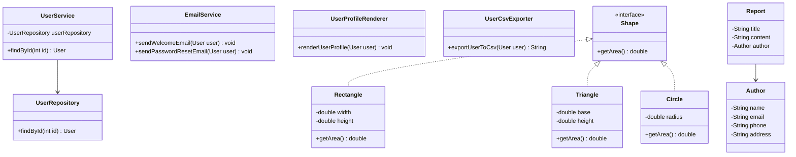

# Bài 1: The Smell Hunter

## 1. Tóm tắt ý tưởng chính của lời giải

Bài tập yêu cầu phân tích 4 đoạn mã Java để xác định các **code smell** đang tồn tại, giải thích lý do và đề xuất kỹ thuật refactor phù hợp. Mục tiêu chính là làm cho mã nguồn dễ đọc hơn, dễ bảo trì hơn và dễ mở rộng hơn mà vẫn giữ nguyên hành vi đầu ra của chương trình.

Các hướng xử lý chính gồm:

- Đặt lại tên biến, tên phương thức cho rõ nghĩa.
- Tách class khi một class đang đảm nhiệm quá nhiều trách nhiệm.
- Thay thế chuỗi điều kiện bằng đa hình khi có nhiều loại đối tượng khác nhau.
- Gom nhóm các thuộc tính liên quan thành một object riêng.
- Loại bỏ magic number và tham số không sử dụng.

Bài không tập trung vào một chương trình chạy hoàn chỉnh mà tập trung vào việc nhận diện lỗi thiết kế và cải thiện cấu trúc mã nguồn.

## 2. Thiết kế hệ thống

### 2.1. Đoạn A - Tính phí dịch vụ

#### Code ban đầu

```java
public double calculateFee(String t, int h, double r, boolean m) {
    double f = h * r;
    if (m) f = f * 0.9;
    return f;
}
```

#### Code smell

- **Obscure Name / Poor Naming**: các tên `t`, `h`, `r`, `m`, `f` quá ngắn và khó hiểu.
- **Magic Number**: giá trị `0.9` xuất hiện trực tiếp trong công thức.
- **Unused Parameter**: tham số `t` không được sử dụng.

#### Kỹ thuật refactor

- Rename Variable.
- Remove Unused Parameter.
- Replace Magic Number with Constant.

#### Code sau refactor

```java
public double calculateFee(int hours, double hourlyRate, boolean isMember) {
    final double MEMBER_DISCOUNT_RATE = 0.9;

    double fee = hours * hourlyRate;

    if (isMember) {
        fee = fee * MEMBER_DISCOUNT_RATE;
    }

    return fee;
}
```

#### Vai trò

Phương thức `calculateFee` dùng để tính phí dựa trên số giờ và đơn giá theo giờ. Nếu người dùng là thành viên, phí được giảm theo hệ số giảm giá.

---

### 2.2. Đoạn B - UserService

#### Code ban đầu

```java
class UserService {
    public User findById(int id) { ... }
    public void sendWelcomeEmail(User user) { ... }
    public void sendPasswordResetEmail(User user) { ... }
    public void renderUserProfile(User user) { ... }
    public String exportUserToCsv(User user) { ... }
}
```

#### Code smell

- **God Class / Large Class**: `UserService` làm quá nhiều việc khác nhau.
- **Vi phạm Single Responsibility Principle**: class vừa tìm kiếm user, vừa gửi email, vừa render giao diện, vừa export CSV.

#### Kỹ thuật refactor

- Extract Class.
- Move Method.
- Tách trách nhiệm theo từng service riêng.

#### Code sau refactor

```java
class UserService {
    private final UserRepository userRepository;

    public UserService(UserRepository userRepository) {
        this.userRepository = userRepository;
    }

    public User findById(int id) {
        return userRepository.findById(id);
    }
}
```

```java
class UserRepository {
    public User findById(int id) {
        // Logic tìm kiếm user
        return null;
    }
}
```

```java
class EmailService {
    public void sendWelcomeEmail(User user) {
        // Logic gửi email chào mừng
    }

    public void sendPasswordResetEmail(User user) {
        // Logic gửi email đặt lại mật khẩu
    }
}
```

```java
class UserProfileRenderer {
    public void renderUserProfile(User user) {
        // Logic hiển thị thông tin user
    }
}
```

```java
class UserCsvExporter {
    public String exportUserToCsv(User user) {
        // Logic xuất user ra định dạng CSV
        return "";
    }
}
```

#### Vai trò các class

| Class | Vai trò |
|---|---|
| `UserService` | Xử lý nghiệp vụ chính liên quan đến user |
| `UserRepository` | Tìm kiếm hoặc truy xuất dữ liệu user |
| `EmailService` | Gửi email cho user |
| `UserProfileRenderer` | Hiển thị thông tin user |
| `UserCsvExporter` | Xuất thông tin user sang CSV |

---

### 2.3. Đoạn C - Tính diện tích hình học

#### Code ban đầu

```java
public double getArea(String shapeType, double a, double b) {
    if (shapeType.equals("rectangle")) return a * b;
    if (shapeType.equals("triangle")) return 0.5 * a * b;
    if (shapeType.equals("circle")) return 3.14159 * a * a;
    return -1;
}
```

#### Code smell

- **Conditional Complexity**: nhiều câu lệnh `if` dùng để phân biệt loại hình.
- **Primitive Obsession**: dùng `String shapeType` để biểu diễn loại hình.
- **Magic Number**: dùng trực tiếp `3.14159` thay vì `Math.PI`.

#### Kỹ thuật refactor

- Replace Conditional with Polymorphism.
- Extract Class.
- Replace Magic Number with `Math.PI`.

#### Code sau refactor

```java
interface Shape {
    double getArea();
}
```

```java
class Rectangle implements Shape {
    private final double width;
    private final double height;

    public Rectangle(double width, double height) {
        this.width = width;
        this.height = height;
    }

    @Override
    public double getArea() {
        return width * height;
    }
}
```

```java
class Triangle implements Shape {
    private final double base;
    private final double height;

    public Triangle(double base, double height) {
        this.base = base;
        this.height = height;
    }

    @Override
    public double getArea() {
        return 0.5 * base * height;
    }
}
```

```java
class Circle implements Shape {
    private final double radius;

    public Circle(double radius) {
        this.radius = radius;
    }

    @Override
    public double getArea() {
        return Math.PI * radius * radius;
    }
}
```

```java
public double getArea(Shape shape) {
    return shape.getArea();
}
```

#### Vai trò các class

| Class / Interface | Vai trò |
|---|---|
| `Shape` | Interface chung cho các hình học có thể tính diện tích |
| `Rectangle` | Biểu diễn hình chữ nhật |
| `Triangle` | Biểu diễn hình tam giác |
| `Circle` | Biểu diễn hình tròn |

#### Logic xử lý

Thay vì truyền vào chuỗi `shapeType` và kiểm tra bằng nhiều câu lệnh `if`, mỗi hình tự định nghĩa cách tính diện tích của riêng nó thông qua phương thức `getArea()`. Khi cần thêm hình mới, chỉ cần tạo class mới implements `Shape`, không cần sửa logic cũ.

---

### 2.4. Đoạn D - Report và Author

#### Code ban đầu

```java
class Report {
    private String title;
    private String content;
    private String authorEmail;
    private String authorName;
    private String authorPhone;
    private String authorAddress;
}
```

#### Code smell

- **Data Clumps**: các thuộc tính `authorEmail`, `authorName`, `authorPhone`, `authorAddress` luôn đi cùng nhau.
- **Primitive Obsession**: thông tin tác giả được biểu diễn bằng nhiều biến `String` rời rạc.

#### Kỹ thuật refactor

- Extract Class.
- Introduce Parameter Object.
- Encapsulate Field.

#### Code sau refactor

```java
class Author {
    private String name;
    private String email;
    private String phone;
    private String address;

    public Author(String name, String email, String phone, String address) {
        this.name = name;
        this.email = email;
        this.phone = phone;
        this.address = address;
    }

    public String getName() {
        return name;
    }

    public String getEmail() {
        return email;
    }

    public String getPhone() {
        return phone;
    }

    public String getAddress() {
        return address;
    }
}
```

```java
class Report {
    private String title;
    private String content;
    private Author author;

    public Report(String title, String content, Author author) {
        this.title = title;
        this.content = content;
        this.author = author;
    }

    public String getTitle() {
        return title;
    }

    public String getContent() {
        return content;
    }

    public Author getAuthor() {
        return author;
    }
}
```

#### Vai trò các class

| Class | Vai trò |
|---|---|
| `Report` | Biểu diễn báo cáo, gồm tiêu đề, nội dung và tác giả |
| `Author` | Biểu diễn thông tin tác giả của báo cáo |

## Sơ đồ lớp



## 3. Lý do lựa chọn hướng tiếp cận và ưu điểm

### Hướng tiếp cận

Lời giải sử dụng cách tiếp cận refactoring theo từng đoạn mã. Mỗi đoạn được phân tích để tìm ra vấn đề thiết kế hoặc vấn đề về khả năng đọc hiểu, sau đó áp dụng kỹ thuật refactor phù hợp.

Cụ thể:

- Đoạn A tập trung vào cải thiện tên biến, loại bỏ tham số thừa và magic number.
- Đoạn B tách một class lớn thành nhiều class nhỏ theo từng trách nhiệm.
- Đoạn C thay thế chuỗi điều kiện bằng đa hình thông qua interface `Shape`.
- Đoạn D gom nhóm dữ liệu tác giả thành class `Author` riêng.

### Ưu điểm

- Mã nguồn dễ đọc và dễ hiểu hơn.
- Mỗi class có trách nhiệm rõ ràng hơn.
- Dễ mở rộng khi cần thêm chức năng mới.
- Giảm rủi ro sửa một phần code nhưng làm ảnh hưởng đến nhiều chức năng khác.
- Tuân thủ tốt hơn các nguyên tắc thiết kế hướng đối tượng, đặc biệt là Single Responsibility Principle và Open/Closed Principle.

### Kiến thức rút ra

Qua bài tập này có thể rút ra một số kiến thức quan trọng:

- Tên biến và tên hàm rõ nghĩa giúp tăng khả năng đọc hiểu code.
- Một class không nên đảm nhiệm quá nhiều trách nhiệm.
- Khi có nhiều điều kiện phân nhánh theo loại đối tượng, có thể cân nhắc dùng đa hình.
- Các nhóm dữ liệu thường xuyên đi cùng nhau nên được tách thành object riêng.
- Refactoring không làm thay đổi hành vi bên ngoài của chương trình mà chỉ cải thiện cấu trúc bên trong.

## 4. Ví dụ

Bài tập không có input từ người dùng. Dữ liệu được mô phỏng trực tiếp thông qua các tham số truyền vào phương thức hoặc thông qua object được tạo trong chương trình.

### Ví dụ với đoạn A

```java
calculateFee(10, 100.0, true);
```

Output mong đợi:

```text
900.0
```

Giải thích: phí gốc là `10 * 100.0 = 1000.0`. Vì là thành viên nên áp dụng giảm giá `1000.0 * 0.9 = 900.0`.

### Ví dụ với đoạn C

```java
Shape rectangle = new Rectangle(4, 5);
Shape triangle = new Triangle(4, 5);
Shape circle = new Circle(3);

System.out.println(rectangle.getArea());
System.out.println(triangle.getArea());
System.out.println(circle.getArea());
```

Output mong đợi:

```text
20.0
10.0
28.274333882308138
```

### Ví dụ với đoạn D

```java
Author author = new Author(
    "Nguyen Van A",
    "a@example.com",
    "0123456789",
    "Ha Noi"
);

Report report = new Report(
    "Monthly Report",
    "Report content...",
    author
);
```

Kết quả: thông tin tác giả không còn nằm rải rác trong `Report`, mà được gom lại trong object `Author`.

## 5. Kết luận

Bài tập đã chỉ ra các code smell phổ biến trong mã nguồn Java như đặt tên không rõ nghĩa, magic number, unused parameter, god class, conditional complexity, primitive obsession và data clumps.

Sau khi refactor, mã nguồn trở nên rõ ràng hơn, có cấu trúc tốt hơn và dễ bảo trì hơn. Các class được tách theo đúng trách nhiệm, logic xử lý được phân chia hợp lý và việc mở rộng chương trình trong tương lai trở nên đơn giản hơn.

## 6. Cách chạy chương trình

Bài này chủ yếu là bài phân tích và refactor các đoạn code ngắn, chưa phải một project Java hoàn chỉnh có sẵn class `Main`.

Nếu muốn chạy thử các đoạn code sau khi refactor, có thể tạo các file Java tương ứng, ví dụ:

```text
Main.java
Shape.java
Rectangle.java
Triangle.java
Circle.java
Author.java
Report.java
```

Sau đó biên dịch:

```bash
javac Main.java Shape.java Rectangle.java Triangle.java Circle.java Author.java Report.java
```

Chạy chương trình:

```bash
java Main
```

Nếu chỉ nộp theo yêu cầu bài tập, có thể trình bày trực tiếp phần nhận diện code smell, giải thích và code đã refactor cho từng đoạn A, B, C, D.
