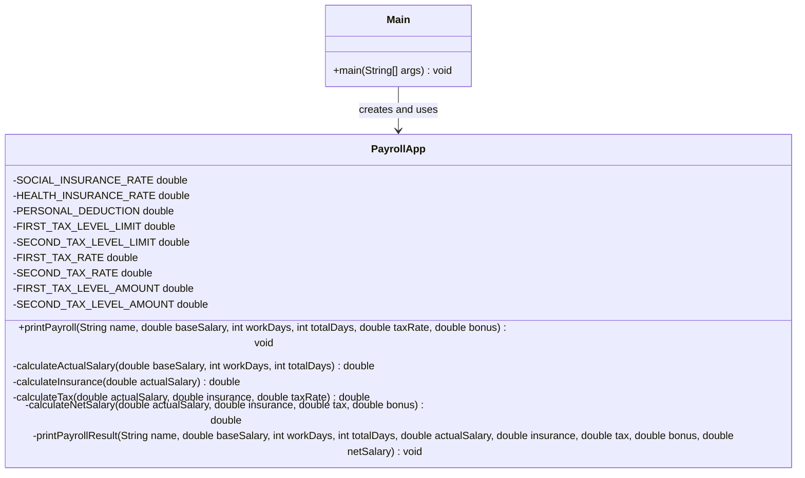

# Bài 2: Extract and Explain

## 1. Tóm tắt ý tưởng chính của lời giải

Bài tập yêu cầu refactor phương thức `printPayroll()` dùng để tính và in bảng lương cuối tháng cho nhân viên. Code ban đầu có nhiều logic tính toán nằm chung trong một phương thức, đồng thời sử dụng nhiều hằng số cứng như `0.08`, `0.015`, `11000000`, `5000000`, `10000000`, v.v.

Lời giải hiện tại áp dụng các kỹ thuật refactor chính:

- **Replace Magic Number with Constant**: thay các số cố định bằng hằng số có tên rõ nghĩa.
- **Extract Method**: tách các khối tính toán thành các phương thức riêng.
- **Introduce Explaining Variable**: thay các biểu thức khó hiểu bằng biến trung gian có tên mô tả rõ ràng.

Sau khi refactor, phương thức `printPayroll()` chỉ còn nhiệm vụ điều phối các bước tính toán và gọi phương thức in kết quả. Output vẫn giữ nguyên định dạng như code ban đầu.

## 2. Thiết kế hệ thống

Chương trình gồm 2 class chính:

### 2.1. Class `Main`

```java
public class Main
```

#### Vai trò

Class `Main` là điểm bắt đầu của chương trình. Class này tạo đối tượng `PayrollApp` và gọi phương thức `printPayroll()` với dữ liệu mẫu.

#### Logic xử lý

Trong phương thức `main()`:

```java
PayrollApp app = new PayrollApp();

app.printPayroll(
        "Nguyễn Văn A",
        20_000_000,
        22,
        26,
        0.20,
        2_000_000
);
```

Dữ liệu mẫu gồm:

- Tên nhân viên: `Nguyễn Văn A`
- Lương cơ bản: `20_000_000`
- Số ngày công thực tế: `22`
- Tổng số ngày công: `26`
- Thuế suất cho phần thu nhập vượt bậc: `0.20`
- Tiền thưởng: `2_000_000`

### 2.2. Class `PayrollApp`

```java
public class PayrollApp
```

#### Vai trò

Class `PayrollApp` chịu trách nhiệm tính toán và in bảng lương cho nhân viên.

#### Thuộc tính / hằng số

Class sử dụng các hằng số để thay thế magic number trong code ban đầu:

```java
private static final double SOCIAL_INSURANCE_RATE = 0.08;
private static final double HEALTH_INSURANCE_RATE = 0.015;

private static final double PERSONAL_DEDUCTION = 11_000_000;

private static final double FIRST_TAX_LEVEL_LIMIT = 5_000_000;
private static final double SECOND_TAX_LEVEL_LIMIT = 10_000_000;

private static final double FIRST_TAX_RATE = 0.05;
private static final double SECOND_TAX_RATE = 0.10;

private static final double FIRST_TAX_LEVEL_AMOUNT = 250_000;
private static final double SECOND_TAX_LEVEL_AMOUNT = 750_000;
```

Ý nghĩa chính:

- `SOCIAL_INSURANCE_RATE`: tỷ lệ bảo hiểm xã hội.
- `HEALTH_INSURANCE_RATE`: tỷ lệ bảo hiểm y tế.
- `PERSONAL_DEDUCTION`: mức giảm trừ cá nhân.
- `FIRST_TAX_LEVEL_LIMIT`: giới hạn thu nhập chịu thuế bậc 1.
- `SECOND_TAX_LEVEL_LIMIT`: giới hạn thu nhập chịu thuế bậc 2.
- `FIRST_TAX_RATE`: thuế suất bậc 1.
- `SECOND_TAX_RATE`: thuế suất bậc 2.
- `FIRST_TAX_LEVEL_AMOUNT`: số tiền thuế cố định sau khi vượt bậc 1.
- `SECOND_TAX_LEVEL_AMOUNT`: số tiền thuế cố định sau khi vượt bậc 2.

#### Phương thức `printPayroll()`

```java
public void printPayroll(String name, double baseSalary,
        int workDays, int totalDays,
        double taxRate, double bonus)
```

Đây là phương thức chính để tính và in bảng lương. Sau khi refactor, phương thức này không còn chứa trực tiếp công thức tính toán dài, mà chỉ gọi các phương thức con:

```java
double actualSalary = calculateActualSalary(baseSalary, workDays, totalDays);
double insurance = calculateInsurance(actualSalary);
double tax = calculateTax(actualSalary, insurance, taxRate);
double netSalary = calculateNetSalary(actualSalary, insurance, tax, bonus);
```

Sau đó phương thức gọi `printPayrollResult()` để in kết quả.

#### Phương thức `calculateActualSalary()`

```java
private double calculateActualSalary(double baseSalary, int workDays, int totalDays)
```

Phương thức này tính lương thực tế theo số ngày công:

```java
return baseSalary * workDays / totalDays;
```

#### Phương thức `calculateInsurance()`

```java
private double calculateInsurance(double actualSalary)
```

Phương thức này tính tổng tiền bảo hiểm từ lương thực tế.

Trong phương thức có hai biến trung gian rõ nghĩa:

```java
double socialInsurance = actualSalary * SOCIAL_INSURANCE_RATE;
double healthInsurance = actualSalary * HEALTH_INSURANCE_RATE;
```

Sau đó trả về tổng bảo hiểm:

```java
return socialInsurance + healthInsurance;
```

#### Phương thức `calculateTax()`

```java
private double calculateTax(double actualSalary, double insurance, double taxRate)
```

Phương thức này tính thuế thu nhập cá nhân dựa trên thu nhập chịu thuế.

Thu nhập chịu thuế được tính bằng:

```java
double taxableIncome = actualSalary - insurance - PERSONAL_DEDUCTION;
```

Nếu `taxableIncome <= 0`, thuế bằng `0`.

Nếu thu nhập chịu thuế nằm trong bậc 1, thuế được tính theo `FIRST_TAX_RATE`.

Nếu thu nhập chịu thuế nằm trong bậc 2, thuế được tính theo công thức có phần cố định `FIRST_TAX_LEVEL_AMOUNT` và phần vượt bậc 1.

Nếu thu nhập chịu thuế vượt bậc 2, thuế được tính theo công thức có phần cố định `SECOND_TAX_LEVEL_AMOUNT` và phần vượt bậc 2 sử dụng `taxRate` truyền vào.

#### Phương thức `calculateNetSalary()`

```java
private double calculateNetSalary(double actualSalary, double insurance,
        double tax, double bonus)
```

Phương thức này tính lương thực nhận:

```java
return actualSalary - insurance - tax + bonus;
```

#### Phương thức `printPayrollResult()`

```java
private void printPayrollResult(String name, double baseSalary,
        int workDays, int totalDays,
        double actualSalary, double insurance,
        double tax, double bonus,
        double netSalary)
```

Phương thức này chỉ chịu trách nhiệm in kết quả bảng lương. Nội dung và thứ tự các dòng `System.out.println(...)` được giữ giống code gốc để đảm bảo output không thay đổi.

## Sơ đồ lớp



## 3. Lý do lựa chọn hướng tiếp cận và ưu điểm

### Hướng tiếp cận

Bài làm chọn cách refactor trực tiếp trên phương thức tính lương ban đầu. Thay vì thay đổi nghiệp vụ hoặc thay đổi output, chương trình giữ nguyên luồng xử lý và tách từng phần tính toán thành phương thức riêng.

Các phần được tách gồm:

- Tính lương thực tế.
- Tính bảo hiểm.
- Tính thuế thu nhập cá nhân.
- Tính lương thực nhận.
- In kết quả bảng lương.

Các hằng số cứng được chuyển thành hằng số `private static final` để tên biến thể hiện rõ ý nghĩa nghiệp vụ.

### Ưu điểm

- Code dễ đọc hơn vì mỗi phương thức có một nhiệm vụ rõ ràng.
- Phương thức `printPayroll()` ngắn gọn hơn và không còn chứa toàn bộ logic tính toán chi tiết.
- Các hằng số như tỷ lệ bảo hiểm, mức giảm trừ và mức thuế được đặt tên rõ ràng.
- Dễ chỉnh sửa khi quy định tính lương, bảo hiểm hoặc thuế thay đổi.
- Dễ kiểm thử riêng từng phần tính toán.
- Output vẫn giữ đúng định dạng ban đầu.

### Kiến thức rút ra

Qua bài này có thể rút ra các kiến thức refactor quan trọng:

- Không nên để một phương thức làm quá nhiều việc.
- Các số có ý nghĩa nghiệp vụ nên được đặt thành hằng số có tên rõ ràng.
- Các biểu thức tính toán nên được tách thành biến trung gian hoặc phương thức riêng nếu chúng khó hiểu.
- Refactor tốt không làm thay đổi hành vi bên ngoài của chương trình.

## 4. Ví dụ

Không có input từ người dùng.

Dữ liệu được mô phỏng trực tiếp trong chương trình tại file `Main.java`:

```java
app.printPayroll(
        "Nguyễn Văn A",
        20_000_000,
        22,
        26,
        0.20,
        2_000_000
);
```

Output thực tế:

```text
=== BẢNG LƯƠNG ===
Nhân viên: Nguyễn Văn A
Lương cơ bản: 2.0E7
Ngày công: 22/26
Lương thực tế: 1.6923076923076923E7
Bảo hiểm: 1607692.3076923077
Thuế TNCN: 215384.61538461532
Thưởng: 2000000.0
Thực nhận: 1.7100000000000004E7
```

## 5. Kết luận

Bài làm đã refactor phương thức tính lương dài thành các phương thức nhỏ, rõ trách nhiệm và dễ bảo trì hơn. Các magic number đã được thay thế bằng hằng số có tên rõ nghĩa. Logic tính toán được giữ nguyên, phần in kết quả vẫn giữ đúng thứ tự và nội dung như ban đầu nên output không thay đổi.

Cấu trúc hiện tại có thể tiếp tục mở rộng nếu cần thêm các loại bảo hiểm, mức giảm trừ hoặc cách tính thuế mới.

## 6. Cách chạy chương trình

Chương trình gồm 2 file Java:

- `Main.java`
- `PayrollApp.java`

### Cách 1: Chạy bằng terminal

1. Biên dịch chương trình:

```bash
javac Main.java PayrollApp.java
```

2. Chạy chương trình:

```bash
java Main
```

### Cách 2: Chạy bằng IDE

Có thể mở project trong IntelliJ IDEA, Eclipse hoặc VS Code, sau đó chạy trực tiếp file `Main.java`.
