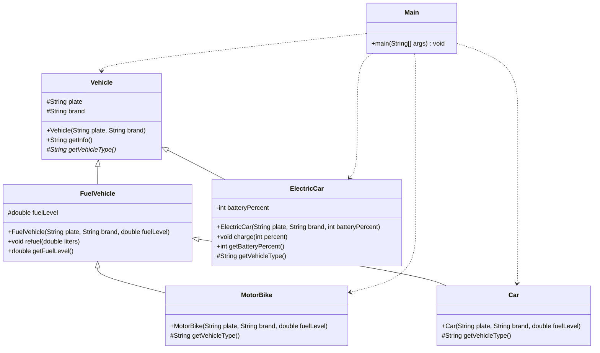

# Bài 3: Refactor theo từng "small steps"

## 1. Tóm tắt ý tưởng chính của lời giải

Bài tập yêu cầu refactor hệ thống quản lý các loại phương tiện gồm xe máy, ô tô và xe điện.

Code ban đầu có lớp cha `Vehicle` chứa cả hai thuộc tính:

- `fuelLevel`: chỉ dùng cho xe chạy xăng.
- `batteryPercent`: chỉ dùng cho xe điện.

Điều này làm các lớp con thừa kế dữ liệu không cần thiết. Ví dụ `ElectricCar` không dùng `fuelLevel`, còn `MotorBike` và `Car` không dùng `batteryPercent`.

Giải pháp refactor là tách hệ thống thành các lớp hợp lý hơn:

- `Vehicle`: chỉ chứa thông tin chung của mọi loại xe.
- `FuelVehicle`: lớp trung gian cho các xe chạy xăng.
- `MotorBike`: xe máy, kế thừa từ `FuelVehicle`.
- `Car`: ô tô, kế thừa từ `FuelVehicle`.
- `ElectricCar`: xe điện, kế thừa trực tiếp từ `Vehicle`.

Ngoài ra, phương thức `getInfo()` trong các lớp con có cấu trúc lặp lại, nên được đưa phần xử lý chung lên lớp cha `Vehicle`. Mỗi lớp con chỉ cần cung cấp tên loại xe thông qua phương thức `getVehicleType()`.

## 2. Thiết kế hệ thống

### 2.1. Lớp `Vehicle`

```java
abstract class Vehicle {
    protected String plate;
    protected String brand;

    public Vehicle(String plate, String brand) {
        this.plate = plate;
        this.brand = brand;
    }

    public String getInfo() {
        return getVehicleType() + " [" + plate + "] - " + brand;
    }

    protected abstract String getVehicleType();
}
```

#### Thuộc tính

| Thuộc tính | Kiểu dữ liệu | Ý nghĩa |
|---|---|---|
| `plate` | `String` | Biển số xe |
| `brand` | `String` | Hãng xe |

#### Vai trò

`Vehicle` là lớp cha trừu tượng, đại diện cho thông tin chung của mọi loại xe.

Lớp này chứa phương thức `getInfo()` để định dạng thông tin xe theo mẫu chung:

```text
Loại xe [biển số] - hãng xe
```

Phương thức `getVehicleType()` được khai báo là abstract để các lớp con tự định nghĩa loại xe cụ thể.

### 2.2. Lớp `FuelVehicle`

```java
abstract class FuelVehicle extends Vehicle {
    protected double fuelLevel;

    public FuelVehicle(String plate, String brand, double fuelLevel) {
        super(plate, brand);
        this.fuelLevel = fuelLevel;
    }

    public void refuel(double liters) {
        fuelLevel += liters;
    }

    public double getFuelLevel() {
        return fuelLevel;
    }
}
```

#### Thuộc tính

| Thuộc tính | Kiểu dữ liệu | Ý nghĩa |
|---|---|---|
| `fuelLevel` | `double` | Lượng nhiên liệu hiện tại của xe |

#### Vai trò

`FuelVehicle` là lớp trung gian dành cho các loại xe chạy bằng xăng.

Lớp này chứa:

- Thuộc tính `fuelLevel`.
- Phương thức `refuel(double liters)` để đổ thêm nhiên liệu.
- Phương thức `getFuelLevel()` để lấy mức nhiên liệu hiện tại.

Việc tách `FuelVehicle` giúp `ElectricCar` không còn phải thừa kế thuộc tính `fuelLevel` không cần thiết.

### 2.3. Lớp `MotorBike`

```java
class MotorBike extends FuelVehicle {

    public MotorBike(String plate, String brand, double fuelLevel) {
        super(plate, brand, fuelLevel);
    }

    @Override
    protected String getVehicleType() {
        return "Xe máy";
    }
}
```

#### Vai trò

`MotorBike` đại diện cho xe máy.

Lớp này kế thừa từ `FuelVehicle` vì xe máy sử dụng nhiên liệu. Do đó, `MotorBike` có thể dùng lại:

- `fuelLevel`
- `refuel()`
- `getFuelLevel()`

Lớp chỉ cần override `getVehicleType()` để trả về tên loại xe là `Xe máy`.

### 2.4. Lớp `Car`

```java
class Car extends FuelVehicle {

    public Car(String plate, String brand, double fuelLevel) {
        super(plate, brand, fuelLevel);
    }

    @Override
    protected String getVehicleType() {
        return "Ô tô";
    }
}
```

#### Vai trò

`Car` đại diện cho ô tô.

Tương tự `MotorBike`, lớp này kế thừa từ `FuelVehicle` vì ô tô dùng nhiên liệu. `Car` chỉ cần định nghĩa loại xe thông qua phương thức `getVehicleType()`.

### 2.5. Lớp `ElectricCar`

```java
class ElectricCar extends Vehicle {
    private int batteryPercent;

    public ElectricCar(String plate, String brand, int batteryPercent) {
        super(plate, brand);
        this.batteryPercent = batteryPercent;
    }

    public void charge(int percent) {
        batteryPercent += percent;

        if (batteryPercent > 100) {
            batteryPercent = 100;
        }
    }

    public int getBatteryPercent() {
        return batteryPercent;
    }

    @Override
    protected String getVehicleType() {
        return "Xe điện";
    }
}
```

#### Thuộc tính

| Thuộc tính | Kiểu dữ liệu | Ý nghĩa |
|---|---|---|
| `batteryPercent` | `int` | Phần trăm pin hiện tại của xe điện |

#### Vai trò

`ElectricCar` đại diện cho xe điện.

Lớp này kế thừa trực tiếp từ `Vehicle`, không kế thừa từ `FuelVehicle`, vì xe điện không sử dụng nhiên liệu.

Lớp có phương thức:

- `charge(int percent)`: sạc thêm pin.
- `getBatteryPercent()`: lấy phần trăm pin hiện tại.

Trong phương thức `charge()`, nếu pin vượt quá `100`, giá trị được giới hạn lại bằng `100`.

### 2.6. Lớp `Main`

```java
public class Main {
    public static void main(String[] args) {
        Vehicle motorBike = new MotorBike("59-A1 12345", "Honda", 5.0);
        Vehicle car = new Car("51F 67890", "Toyota", 20.0);
        Vehicle electricCar = new ElectricCar("30E 99999", "VinFast", 80);

        System.out.println(motorBike.getInfo());
        System.out.println(car.getInfo());
        System.out.println(electricCar.getInfo());
    }
}
```

#### Vai trò

`Main` dùng để tạo dữ liệu mẫu và kiểm tra output sau khi refactor.

Ba đối tượng được tạo gồm:

- Một xe máy.
- Một ô tô.
- Một xe điện.

Tất cả được khai báo theo kiểu `Vehicle` và gọi chung phương thức `getInfo()` để kiểm tra tính đa hình.

## Sơ đồ lớp



## 3. Lý do lựa chọn hướng tiếp cận và ưu điểm

### Hướng tiếp cận

Bài được refactor theo từng bước nhỏ:

1. Xác định dữ liệu chung thật sự của mọi loại xe.
2. Giữ `plate` và `brand` trong `Vehicle`.
3. Tách `fuelLevel` sang lớp `FuelVehicle` vì chỉ xe chạy xăng mới cần thuộc tính này.
4. Chuyển `batteryPercent` xuống riêng `ElectricCar` vì chỉ xe điện mới dùng pin.
5. Đưa logic định dạng thông tin `getInfo()` lên lớp cha để tránh lặp code.
6. Cho các lớp con override `getVehicleType()` để cung cấp tên loại xe.

### Ưu điểm

- Tránh việc lớp con thừa kế thuộc tính không cần thiết.
- Cấu trúc kế thừa hợp lý hơn.
- Code dễ đọc và dễ mở rộng.
- Giảm trùng lặp trong phương thức `getInfo()`.
- Khi muốn đổi định dạng thông tin xe, chỉ cần sửa ở lớp `Vehicle`.
- Có thể sử dụng đa hình khi khai báo các đối tượng con dưới kiểu `Vehicle`.

### Kiến thức rút ra

Qua bài này có thể rút ra các kiến thức refactor quan trọng:

- Không nên đặt dữ liệu không dùng chung vào lớp cha.
- Lớp cha chỉ nên chứa những thuộc tính và hành vi thật sự chung.
- Có thể dùng lớp trung gian để gom nhóm các lớp con có chung đặc điểm.
- Nên đưa logic bị lặp lên lớp cha nếu các lớp con có cùng cấu trúc xử lý.
- Đa hình giúp gọi cùng một phương thức `getInfo()` nhưng cho kết quả phù hợp với từng loại xe.

## 4. Ví dụ

Không có input từ người dùng.

Dữ liệu được mô phỏng trực tiếp trong chương trình:

```java
Vehicle motorBike = new MotorBike("59-A1 12345", "Honda", 5.0);
Vehicle car = new Car("51F 67890", "Toyota", 20.0);
Vehicle electricCar = new ElectricCar("30E 99999", "VinFast", 80);
```

Output mong đợi:

```text
Xe máy [59-A1 12345] - Honda
Ô tô [51F 67890] - Toyota
Xe điện [30E 99999] - VinFast
```

Output cho thấy phương thức `getInfo()` đã hoạt động đúng với cả ba loại xe.

## 5. Kết luận

Sau khi refactor, chương trình có cấu trúc rõ ràng hơn so với ban đầu.

Lớp `Vehicle` chỉ còn chứa thông tin chung của mọi loại xe. Các xe chạy xăng được gom vào lớp trung gian `FuelVehicle`, còn xe điện tự quản lý phần pin trong lớp `ElectricCar`.

Phương thức `getInfo()` không còn bị lặp ở nhiều lớp con. Thay vào đó, lớp cha `Vehicle` định nghĩa format chung, còn các lớp con chỉ cung cấp tên loại xe.

Cách thiết kế này giúp chương trình dễ bảo trì, dễ mở rộng và đúng hơn với nguyên tắc lập trình hướng đối tượng.

## 6. Cách chạy chương trình

Giả sử chương trình được tách thành các file:

- `Vehicle.java`
- `FuelVehicle.java`
- `MotorBike.java`
- `Car.java`
- `ElectricCar.java`
- `Main.java`

Biên dịch chương trình:

```bash
javac Vehicle.java FuelVehicle.java MotorBike.java Car.java ElectricCar.java Main.java
```

Chạy chương trình:

```bash
java Main
```

Nếu toàn bộ class được viết chung trong một file `Main.java`, có thể biên dịch và chạy như sau:

```bash
javac Main.java
java Main
```
