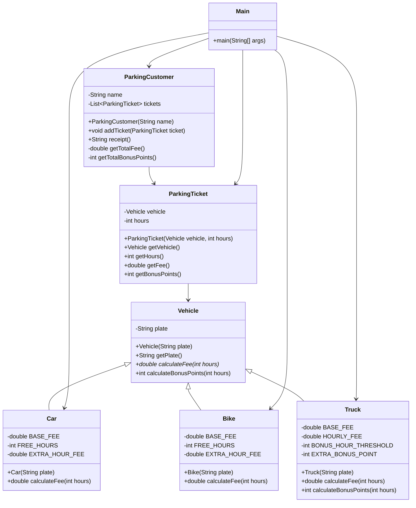

# Bài 4: Refactor with "small steps"

## 1. Tóm tắt ý tưởng chính của lời giải

Bài toán yêu cầu refactor đoạn mã tính hóa đơn gửi xe. Code ban đầu có phương thức `receipt()` trong lớp `ParkingCustomer` quá dài, vừa tính phí, tính điểm thưởng, vừa ghép chuỗi hóa đơn.

Hướng giải quyết là refactor từng bước nhỏ để đảm bảo mỗi bước đều giữ nguyên output:

- Tách logic tính phí ra phương thức riêng.
- Tách logic tính điểm thưởng ra phương thức riêng.
- Chuyển logic tính phí và điểm thưởng sang lớp phù hợp hơn.
- Thay biến tạm bằng các phương thức truy vấn.
- Loại bỏ `switch` bằng đa hình, tạo các lớp con `Car`, `Bike`, `Truck` kế thừa `Vehicle`.

Sau refactor, lớp `ParkingCustomer` chỉ còn chịu trách nhiệm quản lý danh sách vé và tạo chuỗi hóa đơn. Logic tính phí và điểm thưởng được giao cho `Vehicle` và các lớp con cụ thể.

## 2. Thiết kế hệ thống

### Lớp `Vehicle`

```java
abstract class Vehicle
```

#### Thuộc tính

- `plate`: biển số xe.

#### Vai trò

`Vehicle` là lớp cha trừu tượng cho các loại xe trong hệ thống. Lớp này chứa thông tin chung của mọi xe và định nghĩa các hành vi chung:

- Lấy biển số xe.
- Tính phí gửi xe.
- Tính điểm thưởng.

#### Logic xử lý

- `calculateFee(int hours)` là phương thức trừu tượng, bắt buộc mỗi loại xe tự cài đặt.
- `calculateBonusPoints(int hours)` mặc định trả về `1`, các loại xe đặc biệt có thể ghi đè nếu cần.

---

### Lớp `Car`

```java
class Car extends Vehicle
```

#### Thuộc tính

Lớp `Car` không có thuộc tính riêng ngoài dữ liệu kế thừa từ `Vehicle`.

#### Hằng số

- `BASE_FEE = 10`
- `FREE_HOURS = 2`
- `EXTRA_HOUR_FEE = 3`

#### Vai trò

Đại diện cho xe ô tô.

#### Logic xử lý

Phí gửi xe ô tô được tính như sau:

- Phí cơ bản: `10`
- Nếu gửi quá `2` giờ, mỗi giờ thêm tính `3`

Công thức:

```java
10 + (hours - 2) * 3
```

áp dụng khi `hours > 2`.

---

### Lớp `Bike`

```java
class Bike extends Vehicle
```

#### Thuộc tính

Lớp `Bike` không có thuộc tính riêng ngoài dữ liệu kế thừa từ `Vehicle`.

#### Hằng số

- `BASE_FEE = 5`
- `FREE_HOURS = 3`
- `EXTRA_HOUR_FEE = 2`

#### Vai trò

Đại diện cho xe máy.

#### Logic xử lý

Phí gửi xe máy được tính như sau:

- Phí cơ bản: `5`
- Nếu gửi quá `3` giờ, mỗi giờ thêm tính `2`

Công thức:

```java
5 + (hours - 3) * 2
```

áp dụng khi `hours > 3`.

---

### Lớp `Truck`

```java
class Truck extends Vehicle
```

#### Thuộc tính

Lớp `Truck` không có thuộc tính riêng ngoài dữ liệu kế thừa từ `Vehicle`.

#### Hằng số

- `BASE_FEE = 15`
- `HOURLY_FEE = 4`
- `BONUS_HOUR_THRESHOLD = 5`
- `EXTRA_BONUS_POINT = 1`

#### Vai trò

Đại diện cho xe tải.

#### Logic xử lý

Phí gửi xe tải được tính theo công thức:

```java
15 + hours * 4
```

Điểm thưởng mặc định là `1`. Nếu xe tải gửi quá `5` giờ thì được cộng thêm `1` điểm thưởng.

---

### Lớp `ParkingTicket`

```java
class ParkingTicket
```

#### Thuộc tính

- `vehicle`: xe gửi trong vé.
- `hours`: số giờ gửi xe.

#### Vai trò

Đại diện cho một vé gửi xe.

#### Logic xử lý

Lớp này không tự tính chi tiết phí, mà ủy quyền cho `Vehicle`:

```java
public double getFee() {
    return vehicle.calculateFee(hours);
}
```

Tương tự, điểm thưởng cũng được lấy từ xe:

```java
public int getBonusPoints() {
    return vehicle.calculateBonusPoints(hours);
}
```

Nhờ đó, `ParkingTicket` chỉ cần biết xe nào được gửi và gửi trong bao lâu.

---

### Lớp `ParkingCustomer`

```java
class ParkingCustomer
```

#### Thuộc tính

- `name`: tên khách hàng.
- `tickets`: danh sách các vé gửi xe.

#### Vai trò

Quản lý danh sách vé của một khách hàng và tạo hóa đơn gửi xe.

#### Logic xử lý

Sau refactor, phương thức `receipt()` chỉ còn chịu trách nhiệm ghép chuỗi hóa đơn:

```java
public String receipt() {
    String result = "Parking Receipt for " + name + "\n";

    for (ParkingTicket each : tickets) {
        result += "\t" + each.getVehicle().getPlate() + "\t" + each.getFee() + "\n";
    }

    result += "Total fee is " + getTotalFee() + "\n";
    result += "You earned " + getTotalBonusPoints() + " bonus points";
    return result;
}
```

Tổng phí và tổng điểm thưởng được tính thông qua các query method:

- `getTotalFee()`
- `getTotalBonusPoints()`

Đây là kết quả của kỹ thuật **Replace Temp with Query**.

---

### Lớp `Main`

```java
public class Main
```

#### Vai trò

Tạo dữ liệu mẫu và in hóa đơn để kiểm tra output sau refactor.

Dữ liệu mẫu gồm:

- Một xe ô tô gửi `4` giờ.
- Một xe máy gửi `5` giờ.
- Một xe tải gửi `6` giờ.

---

### Lớp `MainCompare`

```java
public class MainCompare
```

#### Vai trò

Dùng để đối chiếu output trước và sau refactor.

Lớp này có thể tạo hai nhóm đối tượng:

- Nhóm code cũ: `OldVehicle`, `OldParkingTicket`, `OldParkingCustomer`
- Nhóm code mới: `Vehicle`, `Car`, `Bike`, `Truck`, `ParkingTicket`, `ParkingCustomer`

Sau đó in ra hai hóa đơn để chứng minh output không thay đổi sau refactor.

Nếu trong bài nộp chỉ giữ lại phiên bản sau refactor thì có thể chỉ cần chạy `Main`.

## Sơ đồ lớp



## 3. Lý do lựa chọn hướng tiếp cận và ưu điểm

### Hướng tiếp cận

Bài được refactor theo nhiều bước nhỏ để dễ kiểm soát và dễ đảm bảo output không đổi.

Các bước chính gồm:

1. **Extract Method**  
   Tách logic tính phí và tính điểm thưởng khỏi `receipt()`.

2. **Move Method**  
   Chuyển logic tính phí và điểm thưởng sang lớp phù hợp hơn.

3. **Replace Temp with Query**  
   Thay các biến tạm `totalFee`, `bonusPoints` bằng các phương thức `getTotalFee()` và `getTotalBonusPoints()`.

4. **Replace Conditional with Polymorphism**  
   Loại bỏ `switch` theo loại xe, thay bằng các lớp con `Car`, `Bike`, `Truck`.

5. **Replace Type Code with Subclasses**  
   Không dùng `int type` như `CAR`, `BIKE`, `TRUCK` nữa. Mỗi loại xe được biểu diễn bằng một class riêng.

### Ưu điểm

- `ParkingCustomer.receipt()` ngắn gọn hơn.
- Mỗi lớp có trách nhiệm rõ ràng hơn.
- Không còn `switch` trong logic tính phí.
- Dễ thêm loại xe mới mà không cần sửa code cũ.
- Logic tính phí nằm đúng nơi hơn: mỗi loại xe tự định nghĩa cách tính phí của nó.
- Dễ kiểm thử từng phần riêng biệt.
- Code dễ đọc, dễ mở rộng và dễ bảo trì hơn.

### Kiến thức rút ra

Qua bài này có thể rút ra các kiến thức quan trọng về refactoring:

- Không nên để một phương thức vừa xử lý nghiệp vụ vừa in kết quả.
- Khi một khối code quá dài, nên tách thành các phương thức nhỏ.
- Khi logic phụ thuộc vào loại đối tượng, nên cân nhắc dùng đa hình thay vì `switch`.
- Các biến tạm dùng để cộng dồn có thể được thay bằng query method để code rõ ràng hơn.
- Refactor nên thực hiện theo từng bước nhỏ để dễ kiểm tra output sau mỗi bước.

## 4. Ví dụ

### Dữ liệu mẫu

Chương trình không nhập dữ liệu từ bàn phím. Dữ liệu được mô phỏng trực tiếp trong `main()`.

```java
ParkingCustomer customer = new ParkingCustomer("Nguyen Van A");

customer.addTicket(new ParkingTicket(new Car("51A-12345"), 4));
customer.addTicket(new ParkingTicket(new Bike("59B1-67890"), 5));
customer.addTicket(new ParkingTicket(new Truck("60C-99999"), 6));

System.out.println(customer.receipt());
```

### Giải thích dữ liệu mẫu

#### Xe ô tô

```java
new Car("51A-12345"), 4
```

Xe ô tô gửi `4` giờ.

Phí:

```text
10 + (4 - 2) * 3 = 16.0
```

Điểm thưởng:

```text
1
```

#### Xe máy

```java
new Bike("59B1-67890"), 5
```

Xe máy gửi `5` giờ.

Phí:

```text
5 + (5 - 3) * 2 = 9.0
```

Điểm thưởng:

```text
1
```

#### Xe tải

```java
new Truck("60C-99999"), 6
```

Xe tải gửi `6` giờ.

Phí:

```text
15 + 6 * 4 = 39.0
```

Điểm thưởng:

```text
2
```

Xe tải được `2` điểm vì mặc định có `1` điểm, và gửi quá `5` giờ nên được cộng thêm `1` điểm.

### Output mong đợi

```text
Parking Receipt for Nguyen Van A
	51A-12345	16.0
	59B1-67890	9.0
	60C-99999	39.0
Total fee is 64.0
You earned 4 bonus points
```

### Output đối chiếu trước và sau refactor

Nếu sử dụng thêm `MainCompare`, output trước và sau refactor phải giống nhau:

```text
=== BEFORE REFACTOR ===
Parking Receipt for Nguyen Van A
	51A-12345	16.0
	59B1-67890	9.0
	60C-99999	39.0
Total fee is 64.0
You earned 4 bonus points

=== AFTER REFACTOR ===
Parking Receipt for Nguyen Van A
	51A-12345	16.0
	59B1-67890	9.0
	60C-99999	39.0
Total fee is 64.0
You earned 4 bonus points
```

## 5. Kết luận

Bài toán ban đầu có phương thức `receipt()` quá dài và chứa nhiều trách nhiệm khác nhau. Sau khi refactor, chương trình được tổ chức lại rõ ràng hơn:

- `ParkingCustomer` quản lý vé và tạo hóa đơn.
- `ParkingTicket` đại diện cho một lượt gửi xe.
- `Vehicle` là lớp cha chung.
- `Car`, `Bike`, `Truck` tự định nghĩa logic tính phí của từng loại xe.

Việc áp dụng đa hình giúp loại bỏ `switch`, giúp chương trình dễ mở rộng hơn khi cần thêm loại xe mới trong tương lai.

## 6. Cách chạy chương trình

### Trường hợp các class được đặt trong nhiều file `.java`

Nếu tách thành nhiều file, có thể có cấu trúc như sau:

```text
Vehicle.java
Car.java
Bike.java
Truck.java
ParkingTicket.java
ParkingCustomer.java
Main.java
```

Biên dịch:

```bash
javac Vehicle.java Car.java Bike.java Truck.java ParkingTicket.java ParkingCustomer.java Main.java
```

Chạy chương trình:

```bash
java Main
```

### Trường hợp có thêm file đối chiếu trước/sau refactor

Nếu có thêm các class code cũ và `MainCompare.java`, biên dịch toàn bộ file Java:

```bash
javac *.java
```

Chạy chương trình đối chiếu:

```bash
java MainCompare
```

### Trường hợp tất cả class đặt chung trong một file `Main.java`

Biên dịch:

```bash
javac Main.java
```

Chạy chương trình:

```bash
java Main
```
