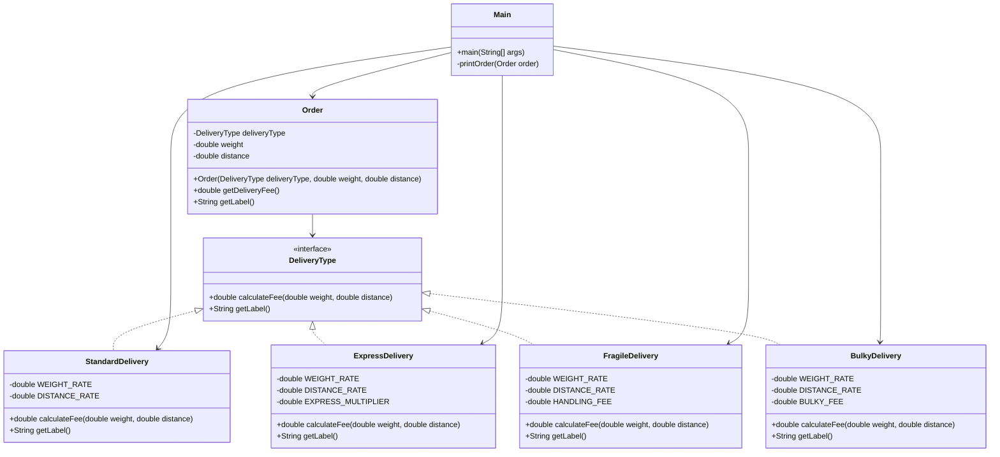

# Bài 5: The delivery calculator

## 1. Tóm tắt ý tưởng chính của lời giải

Bài toán yêu cầu refactor đoạn code tính phí giao hàng dựa trên loại đơn hàng.

Code ban đầu dùng thuộc tính:

```java
private String type; // "STANDARD", "EXPRESS", "FRAGILE"
```

Sau đó trong các phương thức `getDeliveryFee()` và `getLabel()`, chương trình dùng nhiều câu lệnh `if else` để kiểm tra loại đơn hàng.

Cách làm này vẫn chạy đúng với các loại đơn hiện tại, nhưng khó mở rộng. Khi cần thêm loại đơn mới như `BULKY`, phải sửa nhiều vị trí trong class `Order`.

Hướng refactor là áp dụng kỹ thuật **Replace Conditional with Polymorphism**:

- Tạo interface `DeliveryType`.
- Mỗi loại giao hàng được biểu diễn bằng một class riêng.
- Mỗi class tự định nghĩa cách tính phí và nhãn của mình.
- Class `Order` không còn kiểm tra chuỗi `type`, mà ủy quyền cho `DeliveryType`.

Sau refactor, khi thêm loại đơn mới, chỉ cần tạo thêm class mới mà không phải sửa logic cũ trong `Order`.

## 2. Thiết kế hệ thống

### Lớp `DeliveryType`

```java
interface DeliveryType
```

#### Vai trò

`DeliveryType` là interface đại diện cho hành vi chung của các loại giao hàng.

#### Phương thức

```java
double calculateFee(double weight, double distance);
```

Dùng để tính phí giao hàng dựa trên:

- `weight`: khối lượng đơn hàng.
- `distance`: khoảng cách giao hàng.

```java
String getLabel();
```

Dùng để trả về nhãn hiển thị của loại đơn hàng.

#### Logic xử lý

Interface này không trực tiếp xử lý công thức tính phí. Nó chỉ định nghĩa hợp đồng chung để các class cụ thể như `StandardDelivery`, `ExpressDelivery`, `FragileDelivery`, `BulkyDelivery` tự cài đặt.

---

### Lớp `StandardDelivery`

```java
class StandardDelivery implements DeliveryType
```

#### Hằng số

- `WEIGHT_RATE = 3000`
- `DISTANCE_RATE = 500`

#### Vai trò

Đại diện cho loại đơn hàng thường.

#### Logic xử lý

Phí giao hàng thường được tính theo công thức:

```java
weight * 3000 + distance * 500
```

Nhãn của đơn hàng thường là:

```text
[THƯỜNG]
```

---

### Lớp `ExpressDelivery`

```java
class ExpressDelivery implements DeliveryType
```

#### Hằng số

- `WEIGHT_RATE = 3000`
- `DISTANCE_RATE = 500`
- `EXPRESS_MULTIPLIER = 1.5`

#### Vai trò

Đại diện cho loại đơn hàng hỏa tốc.

#### Logic xử lý

Đơn hỏa tốc được tính dựa trên phí đơn thường, sau đó nhân thêm hệ số `1.5`.

Công thức:

```java
(weight * 3000 + distance * 500) * 1.5
```

Nhãn của đơn hàng hỏa tốc là:

```text
[HỎA TỐC]
```

---

### Lớp `FragileDelivery`

```java
class FragileDelivery implements DeliveryType
```

#### Hằng số

- `WEIGHT_RATE = 5000`
- `DISTANCE_RATE = 700`
- `HANDLING_FEE = 20000`

#### Vai trò

Đại diện cho loại đơn hàng dễ vỡ.

#### Logic xử lý

Đơn hàng dễ vỡ có phí xử lý riêng là `20000`.

Công thức:

```java
weight * 5000 + distance * 700 + 20000
```

Nhãn của đơn hàng dễ vỡ là:

```text
[HÀNG DỄ VỠ]
```

---

### Lớp `BulkyDelivery`

```java
class BulkyDelivery implements DeliveryType
```

#### Hằng số

- `WEIGHT_RATE = 4000`
- `DISTANCE_RATE = 600`
- `BULKY_FEE = 50000`

#### Vai trò

Đại diện cho loại đơn hàng cồng kềnh.

#### Logic xử lý

Đơn hàng cồng kềnh có phụ phí riêng là `50000`.

Công thức:

```java
weight * 4000 + distance * 600 + 50000
```

Nhãn của đơn hàng cồng kềnh là:

```text
[HÀNG CỒNG KỀNH]
```

---

### Lớp `Order`

```java
class Order
```

#### Thuộc tính

- `deliveryType`: loại giao hàng, có kiểu `DeliveryType`.
- `weight`: khối lượng đơn hàng.
- `distance`: khoảng cách giao hàng.

#### Vai trò

Đại diện cho một đơn hàng cần tính phí giao.

#### Logic xử lý

Sau refactor, `Order` không còn kiểm tra loại đơn bằng `if else`.

Thay vào đó, `Order` gọi đa hình thông qua `DeliveryType`:

```java
public double getDeliveryFee() {
    return deliveryType.calculateFee(weight, distance);
}
```

```java
public String getLabel() {
    return deliveryType.getLabel();
}
```

Nhờ đó, `Order` không cần biết chi tiết công thức tính phí của từng loại đơn hàng.

---

### Lớp `Main`

```java
public class Main
```

#### Vai trò

Tạo dữ liệu mẫu và in ra nhãn cùng phí giao hàng để kiểm tra kết quả sau refactor.

Dữ liệu mẫu gồm ít nhất 4 loại đơn hàng:

- Đơn thường.
- Đơn hỏa tốc.
- Đơn hàng dễ vỡ.
- Đơn hàng cồng kềnh.

## Sơ đồ lớp



## 3. Lý do lựa chọn hướng tiếp cận và ưu điểm

### Hướng tiếp cận

Bài được refactor bằng kỹ thuật **Replace Conditional with Polymorphism**.

Trong thiết kế cũ, class `Order` phải tự kiểm tra loại đơn hàng bằng các chuỗi:

```java
"STANDARD"
"EXPRESS"
"FRAGILE"
```

Việc này làm class `Order` phụ thuộc trực tiếp vào toàn bộ các loại đơn.

Trong thiết kế mới, mỗi loại đơn hàng được tách thành một class riêng:

- `StandardDelivery`
- `ExpressDelivery`
- `FragileDelivery`
- `BulkyDelivery`

Các class này cùng implement interface `DeliveryType`.

Nhờ đó, `Order` chỉ làm việc với interface chung, không cần quan tâm đối tượng cụ thể là đơn thường, đơn hỏa tốc, hàng dễ vỡ hay hàng cồng kềnh.

### Ưu điểm

- Loại bỏ chuỗi điều kiện `if else` trong `Order`.
- Giảm rủi ro sai chuỗi type như `"EXPRES"` hoặc `"STANDARDD"`.
- Dễ thêm loại giao hàng mới.
- Mỗi loại giao hàng có công thức tính phí và nhãn riêng.
- Code dễ đọc và dễ kiểm thử hơn.
- Tuân thủ tốt hơn nguyên tắc **Open/Closed Principle**.

### Kiến thức rút ra

Qua bài này có thể rút ra các kiến thức chính:

- Khi một class có nhiều nhánh điều kiện theo type, nên cân nhắc dùng đa hình.
- Không nên dùng `String` để điều khiển logic nghiệp vụ phức tạp.
- Interface giúp tách phần ổn định và phần thay đổi.
- Thêm hành vi mới bằng cách thêm class mới thường an toàn hơn sửa nhiều nhánh `if else` trong code cũ.
- Refactor tốt giúp chương trình dễ mở rộng mà vẫn giữ nguyên output.

## 4. Ví dụ

### Dữ liệu mẫu

Chương trình không nhập dữ liệu từ bàn phím. Dữ liệu được mô phỏng trực tiếp trong `main()`.

```java
public class Main {
    public static void main(String[] args) {
        Order standardOrder = new Order(new StandardDelivery(), 10, 20);
        Order expressOrder = new Order(new ExpressDelivery(), 10, 20);
        Order fragileOrder = new Order(new FragileDelivery(), 10, 20);
        Order bulkyOrder = new Order(new BulkyDelivery(), 10, 20);

        printOrder(standardOrder);
        printOrder(expressOrder);
        printOrder(fragileOrder);
        printOrder(bulkyOrder);
    }

    private static void printOrder(Order order) {
        System.out.println(order.getLabel() + " Phí giao hàng: " + order.getDeliveryFee());
    }
}
```

### Giải thích dữ liệu mẫu

Các đơn hàng đều có:

```text
weight = 10
distance = 20
```

#### Đơn thường

Công thức:

```text
weight * 3000 + distance * 500
```

Thay số:

```text
10 * 3000 + 20 * 500 = 40000.0
```

Nhãn:

```text
[THƯỜNG]
```

#### Đơn hỏa tốc

Công thức:

```text
(weight * 3000 + distance * 500) * 1.5
```

Thay số:

```text
(10 * 3000 + 20 * 500) * 1.5 = 60000.0
```

Nhãn:

```text
[HỎA TỐC]
```

#### Đơn hàng dễ vỡ

Công thức:

```text
weight * 5000 + distance * 700 + 20000
```

Thay số:

```text
10 * 5000 + 20 * 700 + 20000 = 84000.0
```

Nhãn:

```text
[HÀNG DỄ VỠ]
```

#### Đơn hàng cồng kềnh

Công thức:

```text
weight * 4000 + distance * 600 + 50000
```

Thay số:

```text
10 * 4000 + 20 * 600 + 50000 = 102000.0
```

Nhãn:

```text
[HÀNG CỒNG KỀNH]
```

### Output mong đợi

```text
[THƯỜNG] Phí giao hàng: 40000.0
[HỎA TỐC] Phí giao hàng: 60000.0
[HÀNG DỄ VỠ] Phí giao hàng: 84000.0
[HÀNG CỒNG KỀNH] Phí giao hàng: 102000.0
```

### So sánh công sức khi thêm loại mới

#### Thiết kế cũ

Nếu cần thêm loại đơn hàng `BULKY`, phải sửa ít nhất 2 chỗ trong class `Order`:

1. Sửa `getDeliveryFee()` để thêm công thức tính phí:

```java
else if (type.equals("BULKY")) {
    return weight * 4000 + distance * 600 + 50000;
}
```

2. Sửa `getLabel()` để thêm nhãn:

```java
if (type.equals("BULKY")) return "[HÀNG CỒNG KỀNH]";
```

Nếu sau này có thêm các phương thức khác như `getEstimatedTime()`, `getDescription()` hoặc `getInsuranceFee()`, thì mỗi loại mới lại phải sửa thêm nhiều chỗ.

#### Thiết kế mới

Với thiết kế mới, để thêm loại đơn hàng `BULKY`, chỉ cần tạo class mới:

```java
class BulkyDelivery implements DeliveryType
```

Sau đó cài đặt:

```java
@Override
public double calculateFee(double weight, double distance) {
    return weight * 4000 + distance * 600 + 50000;
}

@Override
public String getLabel() {
    return "[HÀNG CỒNG KỀNH]";
}
```

Không cần sửa class `Order`.

## 5. Kết luận

Code ban đầu vẫn hoạt động đúng, nhưng phụ thuộc nhiều vào chuỗi `type` và các nhánh điều kiện. Khi thêm loại đơn hàng mới, lập trình viên phải sửa nhiều vị trí trong class `Order`, làm tăng nguy cơ lỗi.

Sau khi refactor:

- `Order` trở nên ngắn gọn hơn.
- Mỗi loại giao hàng có class riêng.
- Công thức tính phí và nhãn được đặt đúng nơi.
- Dễ thêm loại giao hàng mới mà không ảnh hưởng đến code cũ.
- Thiết kế linh hoạt hơn nhờ áp dụng đa hình.

Bài này minh họa rõ lợi ích của kỹ thuật **Replace Conditional with Polymorphism** trong việc loại bỏ các nhánh điều kiện lặp lại và cải thiện khả năng mở rộng của chương trình.

## 6. Cách chạy chương trình

### Trường hợp các class đặt trong nhiều file `.java`

Nếu tách thành nhiều file, có thể có cấu trúc như sau:

```text
DeliveryType.java
StandardDelivery.java
ExpressDelivery.java
FragileDelivery.java
BulkyDelivery.java
Order.java
Main.java
```

Biên dịch:

```bash
javac DeliveryType.java StandardDelivery.java ExpressDelivery.java FragileDelivery.java BulkyDelivery.java Order.java Main.java
```

Chạy chương trình:

```bash
java Main
```

### Trường hợp tất cả class đặt chung trong một file `Main.java`

Biên dịch:

```bash
javac Main.java
```

Chạy chương trình:

```bash
java Main
```
