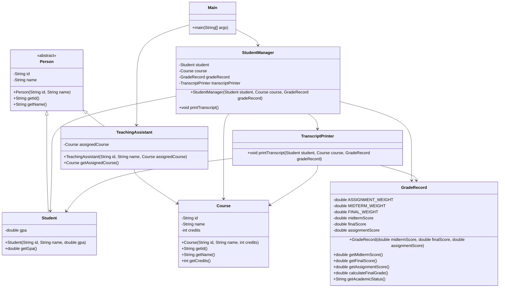

# Bài 6: The God Class

## 1. Tóm tắt ý tưởng chính của lời giải

Bài toán yêu cầu phân tích và refactor lớp `StudentManager` đang đảm nhận quá nhiều trách nhiệm.

Trong code ban đầu, `StudentManager` vừa lưu thông tin sinh viên, vừa lưu thông tin môn học, vừa lưu điểm thành phần, vừa tính điểm tổng kết, xếp loại học lực và in bảng điểm.

Đây là dấu hiệu của **God Class** vì một lớp đang biết và làm quá nhiều việc.

Hướng giải quyết là áp dụng kỹ thuật **Extract Class** để tách `StudentManager` thành các lớp nhỏ hơn, mỗi lớp có một trách nhiệm rõ ràng:

- `Person`: lưu thông tin chung của người trong hệ thống.
- `Student`: lưu thông tin sinh viên, có thêm `gpa`.
- `TeachingAssistant`: lưu thông tin trợ giảng, có `id`, `name` nhưng không có `gpa`.
- `Course`: lưu thông tin môn học.
- `GradeRecord`: lưu điểm thành phần, tính điểm tổng kết và học lực.
- `TranscriptPrinter`: in bảng điểm.
- `StudentManager`: chỉ còn đóng vai trò điều phối việc in bảng điểm.

Sau refactor, output của `printTranscript()` vẫn giữ nguyên so với code gốc.

## 2. Thiết kế hệ thống

### Lớp `Person`

```java
abstract class Person
```

#### Thuộc tính

- `id`: mã định danh.
- `name`: tên người.

#### Vai trò

`Person` là lớp cha trừu tượng dùng để chứa các thông tin chung của những đối tượng có `id` và `name`.

Lớp này được tạo để tránh việc ép `TeachingAssistant` kế thừa từ `Student`, vì trợ giảng có `id` và `name` nhưng không có `gpa`.

#### Logic xử lý

`Person` cung cấp các phương thức getter:

```java
public String getId()
public String getName()
```

---

### Lớp `Student`

```java
class Student extends Person
```

#### Thuộc tính

- `gpa`: điểm trung bình tích lũy của sinh viên.

#### Vai trò

Đại diện cho sinh viên trong hệ thống.

Sinh viên có các thông tin chung từ `Person`:

- `id`
- `name`

và có thêm thông tin riêng:

- `gpa`

#### Logic xử lý

Lớp `Student` chỉ lưu dữ liệu sinh viên và cung cấp getter cho `gpa`.

---

### Lớp `TeachingAssistant`

```java
class TeachingAssistant extends Person
```

#### Thuộc tính

- `assignedCourse`: môn học mà trợ giảng phụ trách.

#### Vai trò

Đại diện cho trợ giảng trong hệ thống.

Trợ giảng có:

- `id`
- `name`

nhưng không có `gpa`.

Vì vậy, `TeachingAssistant` kế thừa từ `Person` thay vì kế thừa từ `Student`.

#### Logic xử lý

Lớp này lưu môn học mà trợ giảng được phân công phụ trách.

---

### Lớp `Course`

```java
class Course
```

#### Thuộc tính

- `id`: mã môn học.
- `name`: tên môn học.
- `credits`: số tín chỉ.

#### Vai trò

Đại diện cho môn học trong hệ thống.

#### Logic xử lý

Lớp `Course` chỉ lưu thông tin môn học và cung cấp các getter:

```java
getId()
getName()
getCredits()
```

---

### Lớp `GradeRecord`

```java
class GradeRecord
```

#### Thuộc tính

- `midtermScore`: điểm giữa kỳ.
- `finalScore`: điểm cuối kỳ.
- `assignmentScore`: điểm bài tập.

#### Hằng số

- `ASSIGNMENT_WEIGHT = 0.2`
- `MIDTERM_WEIGHT = 0.3`
- `FINAL_WEIGHT = 0.5`

#### Vai trò

Đại diện cho bản ghi điểm của một sinh viên trong một môn học.

#### Logic xử lý

Lớp này chịu trách nhiệm tính điểm tổng kết:

```java
assignmentScore * 0.2 + midtermScore * 0.3 + finalScore * 0.5
```

và xác định học lực:

- Từ `8.5` trở lên: `Giỏi`
- Từ `7.0` trở lên: `Khá`
- Từ `5.5` trở lên: `Trung bình`
- Dưới `5.5`: `Yếu`

---

### Lớp `TranscriptPrinter`

```java
class TranscriptPrinter
```

#### Vai trò

Chịu trách nhiệm in bảng điểm ra màn hình.

#### Logic xử lý

Lớp này nhận vào:

- `Student`
- `Course`
- `GradeRecord`

Sau đó in thông tin theo đúng format của code gốc:

```java
System.out.println("Sinh viên: " + student.getName() + " (" + student.getId() + ")");
System.out.println("Môn học: " + course.getName() + " (" + course.getId() + ") - "
        + course.getCredits() + " tín chỉ");
System.out.println("Điểm GK: " + gradeRecord.getMidtermScore()
        + " | Điểm CK: " + gradeRecord.getFinalScore()
        + " | Điểm BT: " + gradeRecord.getAssignmentScore());
System.out.printf("Điểm tổng kết: %.1f - Học lực: %s%n",
        gradeRecord.calculateFinalGrade(),
        gradeRecord.getAcademicStatus());
```

---

### Lớp `StudentManager`

```java
class StudentManager
```

#### Thuộc tính

- `student`: sinh viên.
- `course`: môn học.
- `gradeRecord`: bản ghi điểm.
- `transcriptPrinter`: đối tượng phụ trách in bảng điểm.

#### Vai trò

Sau refactor, `StudentManager` không còn là God Class.

Lớp này chỉ đóng vai trò điều phối việc in bảng điểm bằng cách gọi `TranscriptPrinter`.

#### Logic xử lý

```java
public void printTranscript() {
    transcriptPrinter.printTranscript(student, course, gradeRecord);
}
```

---

### Lớp `Main`

```java
public class Main
```

#### Vai trò

Tạo dữ liệu mẫu và chạy chương trình để kiểm tra output.

Dữ liệu mẫu gồm:

- Một sinh viên.
- Một môn học.
- Một bản ghi điểm.
- Một trợ giảng phụ trách môn học.

## Sơ đồ lớp



## 3. Lý do lựa chọn hướng tiếp cận và ưu điểm

### Hướng tiếp cận

Bài được refactor bằng kỹ thuật **Extract Class**.

Code ban đầu gom nhiều nhóm dữ liệu và hành vi vào một lớp duy nhất:

- Thông tin sinh viên.
- Thông tin môn học.
- Thông tin điểm.
- Tính điểm tổng kết.
- Xếp loại học lực.
- In bảng điểm.

Sau refactor, mỗi nhóm trách nhiệm được tách thành một class riêng.

Ngoài ra, để xử lý yêu cầu thêm `TeachingAssistant`, thiết kế được mở rộng bằng lớp cha `Person`. `Person` chứa phần chung là `id` và `name`, còn `Student` và `TeachingAssistant` chứa phần riêng của từng loại đối tượng.

### Ưu điểm

- `StudentManager` không còn quá nhiều trách nhiệm.
- Dữ liệu sinh viên, môn học và điểm được tách rõ ràng.
- Logic tính điểm được đặt gần dữ liệu điểm trong `GradeRecord`.
- Logic in bảng điểm được tách riêng trong `TranscriptPrinter`.
- Dễ thêm `TeachingAssistant` mà không làm sai mô hình dữ liệu.
- Tránh việc trợ giảng phải có `gpa`.
- Code dễ đọc, dễ bảo trì và dễ mở rộng hơn.
- Tuân thủ tốt hơn nguyên tắc **Single Responsibility Principle**.

### Kiến thức rút ra

Qua bài này có thể rút ra các kiến thức chính:

- Một class không nên đảm nhận quá nhiều trách nhiệm.
- Khi thấy một class có nhiều nhóm dữ liệu khác nhau, nên cân nhắc tách class.
- Không nên ép một class kế thừa từ class khác chỉ vì có vài thuộc tính giống nhau.
- Nên tách phần chung thành class cha hoặc interface nếu nhiều loại đối tượng cùng chia sẻ dữ liệu.
- Refactor tốt giúp hệ thống dễ mở rộng mà vẫn giữ nguyên output.

## 4. Ví dụ

### Dữ liệu mẫu

Chương trình không nhập dữ liệu từ bàn phím. Dữ liệu được mô phỏng trực tiếp trong `main()`.

```java
public class Main {
    public static void main(String[] args) {
        Course oop = new Course("OOP101", "Lập trình hướng đối tượng", 3);

        Student student = new Student("SV001", "Nguyễn Văn A", 3.2);
        GradeRecord gradeRecord = new GradeRecord(8.0, 9.0, 7.5);

        StudentManager studentManager = new StudentManager(student, oop, gradeRecord);
        studentManager.printTranscript();

        TeachingAssistant teachingAssistant = new TeachingAssistant("TA001", "Trần Thị B", oop);

        System.out.println("Trợ giảng: "
                + teachingAssistant.getName()
                + " ("
                + teachingAssistant.getId()
                + ") - Phụ trách môn: "
                + teachingAssistant.getAssignedCourse().getName());
    }
}
```

### Giải thích dữ liệu mẫu

Sinh viên:

```text
SV001 - Nguyễn Văn A
GPA: 3.2
```

Môn học:

```text
OOP101 - Lập trình hướng đối tượng
Số tín chỉ: 3
```

Điểm thành phần:

```text
Điểm bài tập: 7.5
Điểm giữa kỳ: 8.0
Điểm cuối kỳ: 9.0
```

Điểm tổng kết được tính theo công thức:

```text
assignmentScore * 0.2 + midtermScore * 0.3 + finalScore * 0.5
```

Thay số:

```text
7.5 * 0.2 + 8.0 * 0.3 + 9.0 * 0.5
= 1.5 + 2.4 + 4.5
= 8.4
```

Vì `8.4 >= 7.0` và `8.4 < 8.5`, học lực là:

```text
Khá
```

Trợ giảng:

```text
TA001 - Trần Thị B
Phụ trách môn: Lập trình hướng đối tượng
```

### Output mong đợi

```text
Sinh viên: Nguyễn Văn A (SV001)
Môn học: Lập trình hướng đối tượng (OOP101) - 3 tín chỉ
Điểm GK: 8.0 | Điểm CK: 9.0 | Điểm BT: 7.5
Điểm tổng kết: 8.4 - Học lực: Khá
Trợ giảng: Trần Thị B (TA001) - Phụ trách môn: Lập trình hướng đối tượng
```

Nếu chỉ kiểm tra yêu cầu giữ nguyên output của `printTranscript()`, phần quan trọng là:

```text
Sinh viên: Nguyễn Văn A (SV001)
Môn học: Lập trình hướng đối tượng (OOP101) - 3 tín chỉ
Điểm GK: 8.0 | Điểm CK: 9.0 | Điểm BT: 7.5
Điểm tổng kết: 8.4 - Học lực: Khá
```

## 5. Kết luận

Lớp `StudentManager` ban đầu là một God Class vì đang quản lý quá nhiều dữ liệu và hành vi không cùng một trách nhiệm.

Sau khi áp dụng **Extract Class**, chương trình được tổ chức lại rõ ràng hơn:

- `Student` lưu thông tin sinh viên.
- `Course` lưu thông tin môn học.
- `GradeRecord` lưu và xử lý điểm.
- `TranscriptPrinter` in bảng điểm.
- `StudentManager` chỉ điều phối việc in bảng điểm.
- `Person` chứa phần chung của `Student` và `TeachingAssistant`.

Thiết kế mới giúp code dễ đọc hơn, dễ bảo trì hơn và phù hợp hơn khi hệ thống cần mở rộng thêm các loại người dùng mới như trợ giảng.

## 6. Cách chạy chương trình

### Trường hợp các class đặt trong nhiều file `.java`

Nếu tách thành nhiều file, có thể có cấu trúc như sau:

```text
Person.java
Student.java
TeachingAssistant.java
Course.java
GradeRecord.java
TranscriptPrinter.java
StudentManager.java
Main.java
```

Biên dịch:

```bash
javac Person.java Student.java TeachingAssistant.java Course.java GradeRecord.java TranscriptPrinter.java StudentManager.java Main.java
```

Chạy chương trình:

```bash
java Main
```

### Trường hợp tất cả class đặt chung trong một file `Main.java`

Biên dịch:

```bash
javac Main.java
```

Chạy chương trình:

```bash
java Main
```
