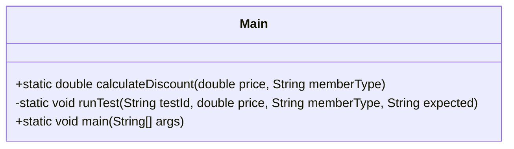

# Bài 1: The discount inspector

## 1. Tóm tắt ý tưởng chính của lời giải

Bài toán yêu cầu kiểm thử hàm:

```java
calculateDiscount(double price, String memberType)
```

Hàm này tính số tiền được giảm giá dựa trên:

- `price`: giá trị đơn hàng.
- `memberType`: loại khách hàng.

Theo đặc tả:

- Nếu `price < 0` thì ném `IllegalArgumentException`.
- Nếu `memberType` là `GUEST` thì không có chiết khấu.
- Nếu `memberType` là `MEMBER`:
  - `price < 100`: chiết khấu `5%`.
  - `price >= 100`: chiết khấu `10%`.
- Nếu `memberType` là `VIP`:
  - `price < 100`: chiết khấu `15%`.
  - `price >= 100`: chiết khấu `20%`.
- Nếu `memberType` khác các giá trị trên thì ném `IllegalArgumentException`.

Bài làm áp dụng 3 kỹ thuật kiểm thử chính:

- **Equivalence Partitioning (EP)**: chia dữ liệu đầu vào thành các lớp tương đương.
- **Boundary Value Analysis (BVA)**: kiểm thử các giá trị ở sát biên `price = 0` và `price = 100`.
- **2-way Combinatorial Testing**: kết hợp các giá trị đại diện của `price` và `memberType` để đảm bảo mọi cặp giá trị xuất hiện trong ít nhất một test case.

## 2. Thiết kế hệ thống

### Lớp `Main`

```java
public class Main
```

#### Vai trò

Lớp `Main` chứa toàn bộ chương trình kiểm thử cho bài toán.

#### Các thành phần chính

- `calculateDiscount(double price, String memberType)`: hàm cần kiểm thử.
- `runTest(String testId, double price, String memberType, String expected)`: hàm hỗ trợ chạy từng test case.
- `main(String[] args)`: nơi gọi toàn bộ các test case theo từng nhóm EP, BVA và 2-way testing.

---

### Phương thức `calculateDiscount`

```java
public static double calculateDiscount(double price, String memberType)
```

#### Tham số

- `price`: giá trị đơn hàng.
- `memberType`: loại khách hàng.

#### Vai trò

Tính số tiền được giảm giá theo loại khách hàng và giá trị đơn hàng.

#### Logic xử lý

Nếu `price < 0`, chương trình ném lỗi:

```java
throw new IllegalArgumentException("Price must be >= 0");
```

Nếu `memberType` là `GUEST`, kết quả là:

```java
0
```

Nếu `memberType` là `MEMBER`:

```java
price < 100  => price * 0.05
price >= 100 => price * 0.10
```

Nếu `memberType` là `VIP`:

```java
price < 100  => price * 0.15
price >= 100 => price * 0.20
```

Nếu `memberType` không hợp lệ:

```java
throw new IllegalArgumentException("Invalid member type: " + memberType);
```

---

### Phương thức `runTest`

```java
private static void runTest(String testId, double price, String memberType, String expected)
```

#### Vai trò

Hàm này dùng để chạy từng test case và in ra kết quả gồm:

- Mã test case.
- Giá trị `price`.
- Giá trị `memberType`.
- Kết quả mong đợi.
- Kết quả thực tế.

#### Logic xử lý

Hàm gọi `calculateDiscount()` trong khối `try`.

Nếu hàm chạy bình thường, in ra giá trị thực tế.

Nếu hàm ném `IllegalArgumentException`, in ra:

```text
IllegalArgumentException
```

Nhờ đó có thể kiểm tra cả trường hợp hợp lệ và không hợp lệ.

## Sơ đồ lớp



## 3. Lý do lựa chọn hướng tiếp cận và ưu điểm

### Hướng tiếp cận

Bài kiểm thử được chia thành 3 nhóm:

1. **Equivalence Partitioning**

   Dùng để chọn các giá trị đại diện cho từng lớp dữ liệu đầu vào.

2. **Boundary Value Analysis**

   Dùng để kiểm tra các điểm biên dễ phát sinh lỗi, cụ thể là:

   - `price = 0`
   - `price = 100`

3. **2-way Combinatorial Testing**

   Dùng để kiểm tra sự kết hợp giữa hai tham số:

   - `price`
   - `memberType`

### Ưu điểm

- Bộ test rõ ràng, có cấu trúc.
- Bao phủ cả dữ liệu hợp lệ và không hợp lệ.
- Kiểm tra được các ranh giới quan trọng.
- Kiểm tra được nhiều tổ hợp giữa `price` và `memberType`.
- Dễ đối chiếu giữa kết quả mong đợi và kết quả thực tế.
- Không cần nhập dữ liệu từ bàn phím, thuận tiện khi chạy lại nhiều lần.

### Kiến thức rút ra

Qua bài này có thể rút ra các kiến thức chính:

- Cách chia lớp tương đương cho dữ liệu đầu vào.
- Cách chọn giá trị biên để kiểm thử.
- Cách thiết kế test case có mã, mô tả, input và expected output.
- Cách kiểm thử ngoại lệ `IllegalArgumentException`.
- Cách kết hợp nhiều tham số bằng 2-way combinatorial testing.

## 4. Ví dụ

### Không có input từ người dùng

Chương trình không nhận input từ bàn phím.

Dữ liệu test được mô phỏng trực tiếp trong phương thức `main()`.

Ví dụ:

```java
runTest("TC03", 50, "MEMBER", "2.5");
runTest("BVA05", 100, "MEMBER", "10.0");
runTest("2W15", 150, "VIP", "30.0");
```

---

### 4.1. Equivalence Partitioning

#### Các lớp tương đương của `price`

| Lớp | Điều kiện | Ý nghĩa | Hợp lệ |
|---|---:|---|---|
| EP1 | `price < 0` | Giá âm | Không |
| EP2 | `price = 0` | Giá bằng 0 | Có |
| EP3 | `0 < price < 100` | Giá nhỏ hơn 100 | Có |
| EP4 | `price = 100` | Giá tại ngưỡng đổi mức giảm | Có |
| EP5 | `price > 100` | Giá lớn hơn 100 | Có |

#### Bảng test case theo EP

| Mã TC | Mô tả | price | memberType | Kết quả mong đợi |
|---|---|---:|---|---|
| TC01 | Giá âm | `-10` | `GUEST` | `IllegalArgumentException` |
| TC02 | Guest không có chiết khấu | `50` | `GUEST` | `0.0` |
| TC03 | Member, giá nhỏ hơn 100 | `50` | `MEMBER` | `2.5` |
| TC04 | Member, giá từ 100 trở lên | `150` | `MEMBER` | `15.0` |
| TC05 | VIP, giá nhỏ hơn 100 | `50` | `VIP` | `7.5` |
| TC06 | VIP, giá từ 100 trở lên | `150` | `VIP` | `30.0` |
| TC07 | Loại thành viên không hợp lệ | `50` | `ADMIN` | `IllegalArgumentException` |

---

### 4.2. Boundary Value Analysis

Các ranh giới quan trọng:

```text
price = 0
price = 100
```

#### Bảng giá trị biên

| Dạng | price | Ý nghĩa |
|---|---:|---|
| min- | `-1` | Ngay dưới 0 |
| min | `0` | Tại 0 |
| min+ | `1` | Ngay trên 0 |
| max- | `99` | Ngay dưới 100 |
| max | `100` | Tại 100 |
| max+ | `101` | Ngay trên 100 |

#### Bảng test case theo BVA

| Mã TC | Mô tả | price | memberType | Kết quả mong đợi |
|---|---|---:|---|---|
| BVA01 | Dưới ranh giới 0 | `-1` | `MEMBER` | `IllegalArgumentException` |
| BVA02 | Tại ranh giới 0 | `0` | `MEMBER` | `0.0` |
| BVA03 | Trên ranh giới 0 | `1` | `MEMBER` | `0.05` |
| BVA04 | Dưới ranh giới 100 | `99` | `MEMBER` | `4.95` |
| BVA05 | Tại ranh giới 100 | `100` | `MEMBER` | `10.0` |
| BVA06 | Trên ranh giới 100 | `101` | `MEMBER` | `10.1` |

---

### 4.3. 2-way Combinatorial Testing

Có 2 tham số cần kết hợp:

- `price`
- `memberType`

#### Giá trị đại diện cho `price`

| Ký hiệu | price | Ý nghĩa |
|---|---:|---|
| P1 | `-1` | Giá không hợp lệ |
| P2 | `50` | Giá hợp lệ nhỏ hơn 100 |
| P3 | `100` | Giá hợp lệ tại ngưỡng 100 |
| P4 | `150` | Giá hợp lệ lớn hơn 100 |

#### Giá trị đại diện cho `memberType`

| Ký hiệu | memberType | Ý nghĩa |
|---|---|---|
| M1 | `GUEST` | Khách |
| M2 | `MEMBER` | Thành viên |
| M3 | `VIP` | Thành viên VIP |
| M4 | `ADMIN` | Không hợp lệ |

Vì chỉ có 2 tham số, 2-way testing tương đương với việc kiểm tra đầy đủ mọi cặp giữa `price` và `memberType`.

Số test case:

```text
4 * 4 = 16
```

#### Bảng test case 2-way

| Mã TC | price | memberType | Kết quả mong đợi |
|---|---:|---|---|
| 2W01 | `-1` | `GUEST` | `IllegalArgumentException` |
| 2W02 | `-1` | `MEMBER` | `IllegalArgumentException` |
| 2W03 | `-1` | `VIP` | `IllegalArgumentException` |
| 2W04 | `-1` | `ADMIN` | `IllegalArgumentException` |
| 2W05 | `50` | `GUEST` | `0.0` |
| 2W06 | `50` | `MEMBER` | `2.5` |
| 2W07 | `50` | `VIP` | `7.5` |
| 2W08 | `50` | `ADMIN` | `IllegalArgumentException` |
| 2W09 | `100` | `GUEST` | `0.0` |
| 2W10 | `100` | `MEMBER` | `10.0` |
| 2W11 | `100` | `VIP` | `20.0` |
| 2W12 | `100` | `ADMIN` | `IllegalArgumentException` |
| 2W13 | `150` | `GUEST` | `0.0` |
| 2W14 | `150` | `MEMBER` | `15.0` |
| 2W15 | `150` | `VIP` | `30.0` |
| 2W16 | `150` | `ADMIN` | `IllegalArgumentException` |

---

### Output mong đợi

Một phần output khi chạy chương trình:

```text
=== EQUIVALENCE PARTITIONING TEST CASES ===
TC01 | price = -10.0 | memberType = GUEST | expected = IllegalArgumentException | actual = IllegalArgumentException
TC02 | price = 50.0 | memberType = GUEST | expected = 0.0 | actual = 0.0
TC03 | price = 50.0 | memberType = MEMBER | expected = 2.5 | actual = 2.5
TC04 | price = 150.0 | memberType = MEMBER | expected = 15.0 | actual = 15.0
TC05 | price = 50.0 | memberType = VIP | expected = 7.5 | actual = 7.5
TC06 | price = 150.0 | memberType = VIP | expected = 30.0 | actual = 30.0
TC07 | price = 50.0 | memberType = ADMIN | expected = IllegalArgumentException | actual = IllegalArgumentException
```

Với các nhóm BVA và 2-way, chương trình cũng in theo định dạng tương tự.

## 5. Kết luận

Bài toán kiểm thử hàm `calculateDiscount()` được giải bằng cách thiết kế bộ test theo ba kỹ thuật:

- **Equivalence Partitioning** để chọn các đại diện tiêu biểu.
- **Boundary Value Analysis** để kiểm tra các ranh giới dễ lỗi.
- **2-way Combinatorial Testing** để kiểm tra mọi cặp giá trị giữa `price` và `memberType`.

Bộ test bao phủ được:

- Giá âm.
- Giá bằng 0.
- Giá nhỏ hơn 100.
- Giá bằng 100.
- Giá lớn hơn 100.
- Loại khách hàng hợp lệ.
- Loại khách hàng không hợp lệ.

Nhờ đó có thể đánh giá hàm `calculateDiscount()` một cách rõ ràng và có hệ thống.

## 6. Cách chạy chương trình

Cấu trúc thư mục gợi ý:

```text
Bai07/
├── src/
│   └── Main.java
├── README.md
└── run.sh
```

### Cách 1: Chạy trực tiếp bằng terminal

Từ thư mục `Bai07`, biên dịch:

```bash
javac src/Main.java
```

Chạy chương trình:

```bash
java -cp src Main
```

### Cách 2: Chạy bằng `run.sh`

Nội dung file `run.sh`:

```bash
#!/bin/bash

javac src/Main.java
java -cp src Main
```

Cấp quyền thực thi cho script:

```bash
chmod +x run.sh
```

Chạy chương trình:

```bash
./run.sh
```
