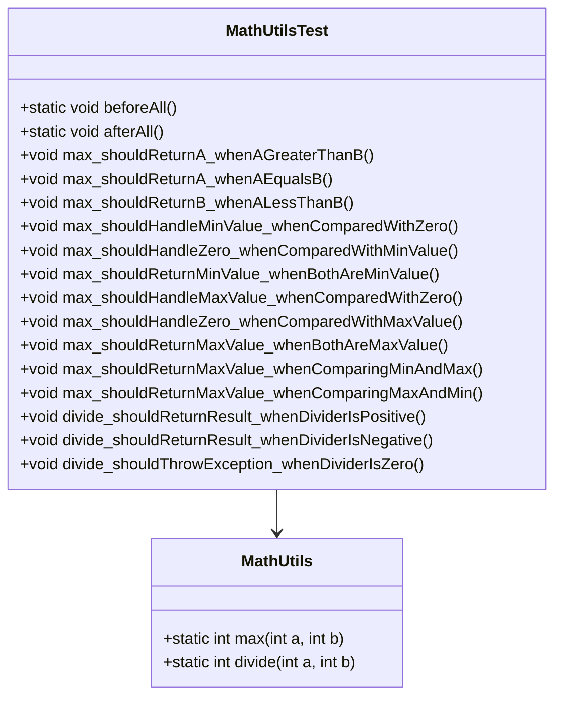

# Bài 2: The first JUnit

## 1. Tóm tắt ý tưởng chính của lời giải

Bài toán yêu cầu kiểm thử class `MathUtils` bằng JUnit.

Class cần kiểm thử có hai phương thức:

```java
public static int max(int a, int b)
```

và:

```java
public static int divide(int a, int b)
```

Trong đó:

- `max(int a, int b)` trả về giá trị lớn hơn giữa `a` và `b`.
- `divide(int a, int b)` trả về kết quả chia nguyên `a / b`.
- Nếu `b == 0`, phương thức `divide()` ném `IllegalArgumentException`.

Bài làm sử dụng **JUnit 5** để viết test trong class `MathUtilsTest`.

Các kỹ thuật kiểm thử được áp dụng:

- **Equivalence Partitioning (EP)** cho `max(int a, int b)` với các trường hợp `a > b`, `a = b`, `a < b`.
- **Boundary Value Analysis (BVA)** cho `max(int a, int b)` tại các giá trị biên `Integer.MIN_VALUE` và `Integer.MAX_VALUE`.
- **Equivalence Partitioning (EP)** cho `divide(int a, int b)` với các trường hợp `b > 0`, `b < 0`, `b = 0`.
- Kiểm thử ngoại lệ khi `b = 0`.
- Sử dụng `@BeforeAll` và `@AfterAll` để in thông báo trước và sau khi chạy toàn bộ test.

## 2. Thiết kế hệ thống

### Lớp `MathUtils`

```java
public class MathUtils
```

#### Vai trò

`MathUtils` là class chứa các phương thức tiện ích toán học cần được kiểm thử.

#### Phương thức `max`

```java
public static int max(int a, int b)
```

##### Vai trò

Trả về số lớn hơn giữa hai số nguyên `a` và `b`.

##### Logic xử lý

```java
if (a >= b) return a;
return b;
```

Nếu `a >= b`, hàm trả về `a`.

Ngược lại, hàm trả về `b`.

---

#### Phương thức `divide`

```java
public static int divide(int a, int b)
```

##### Vai trò

Thực hiện phép chia nguyên `a / b`.

##### Logic xử lý

Nếu `b == 0`, hàm ném ngoại lệ:

```java
throw new IllegalArgumentException("Divider must not be zero");
```

Nếu `b != 0`, hàm trả về:

```java
a / b
```

---

### Lớp `MathUtilsTest`

```java
public class MathUtilsTest
```

#### Vai trò

`MathUtilsTest` là class chứa các test case kiểm thử cho `MathUtils`.

#### Các annotation JUnit được sử dụng

```java
@BeforeAll
```

Chạy một lần trước tất cả test case.

```java
@AfterAll
```

Chạy một lần sau khi tất cả test case kết thúc.

```java
@Test
```

Đánh dấu một phương thức là test case.

#### Các assertion được sử dụng

```java
assertEquals(expected, actual)
```

Dùng để kiểm tra kết quả thực tế có đúng với kết quả mong đợi hay không.

```java
assertThrows(ExceptionClass.class, executable)
```

Dùng để kiểm tra một đoạn code có ném đúng loại ngoại lệ mong đợi hay không.

---

### Giải thích vì sao `@BeforeAll` phải là `static`

Trong JUnit 5, `@BeforeAll` được chạy một lần duy nhất trước toàn bộ test case trong class.

Theo mặc định, JUnit tạo object test cho từng test method. Tuy nhiên, `@BeforeAll` chạy ở cấp class, trước khi các test method được thực thi, nên phương thức này không gắn với một object test cụ thể.

Vì vậy, phương thức được đánh dấu `@BeforeAll` phải khai báo là `static`.

Ví dụ đúng:

```java
@BeforeAll
static void beforeAll() {
    System.out.println("=== Bắt đầu chạy MathUtilsTest ===");
}
```

Tương tự, `@AfterAll` cũng nên khai báo là `static`:

```java
@AfterAll
static void afterAll() {
    System.out.println("=== Kết thúc ===");
}
```

## Sơ đồ lớp



## 3. Lý do lựa chọn hướng tiếp cận và ưu điểm

### Hướng tiếp cận

Bài làm dùng JUnit 5 để kiểm thử tự động thay vì tự in kết quả bằng `System.out.println`.

Các test case được chia thành từng nhóm rõ ràng:

1. Kiểm thử `max()` bằng Equivalence Partitioning.
2. Kiểm thử `max()` bằng Boundary Value Analysis.
3. Kiểm thử `divide()` bằng Equivalence Partitioning.
4. Kiểm thử ngoại lệ khi chia cho `0`.

Mỗi test case kiểm tra một hành vi cụ thể của chương trình.

### Ưu điểm

- Test case rõ ràng, dễ đọc.
- Có thể chạy tự động bằng Maven.
- Dễ phát hiện lỗi khi sửa code.
- Có thể kiểm tra cả kết quả trả về và ngoại lệ.
- Phù hợp với cấu trúc project Java chuẩn.
- Dễ mở rộng thêm test case mới.

### Kiến thức rút ra

Qua bài này có thể rút ra các kiến thức chính:

- Cách viết test với JUnit 5.
- Cách dùng `@Test`.
- Cách dùng `@BeforeAll` và `@AfterAll`.
- Cách dùng `assertEquals()` để kiểm tra kết quả.
- Cách dùng `assertThrows()` để kiểm tra ngoại lệ.
- Cách thiết kế test case theo EP và BVA.
- Cách tổ chức project Maven cho bài kiểm thử Java.

## 4. Ví dụ

### Không có input từ người dùng

Chương trình không nhập dữ liệu từ bàn phím.

Dữ liệu test được viết trực tiếp trong class `MathUtilsTest`.

---

### 4.1. Test case cho `max(int a, int b)`

#### Equivalence Partitioning

Với hàm:

```java
max(int a, int b)
```

các lớp tương đương gồm:

| Lớp | Điều kiện | Kết quả mong đợi |
|---|---|---|
| EP1 | `a > b` | Trả về `a` |
| EP2 | `a = b` | Trả về `a` |
| EP3 | `a < b` | Trả về `b` |

Bảng test case:

| Mã TC | Mô tả | a | b | Expected |
|---|---|---:|---:|---:|
| MAX_EP_01 | `a > b` | `10` | `5` | `10` |
| MAX_EP_02 | `a = b` | `7` | `7` | `7` |
| MAX_EP_03 | `a < b` | `3` | `9` | `9` |

Code test tương ứng:

```java
@Test
void max_shouldReturnA_whenAGreaterThanB() {
    assertEquals(10, MathUtils.max(10, 5));
}

@Test
void max_shouldReturnA_whenAEqualsB() {
    assertEquals(7, MathUtils.max(7, 7));
}

@Test
void max_shouldReturnB_whenALessThanB() {
    assertEquals(9, MathUtils.max(3, 9));
}
```

---

#### Boundary Value Analysis

Vì `a` và `b` có kiểu `int`, các biên quan trọng là:

```java
Integer.MIN_VALUE
Integer.MAX_VALUE
```

Bảng test case:

| Mã TC | Mô tả | a | b | Expected |
|---|---|---:|---:|---:|
| MAX_BVA_01 | `a = Integer.MIN_VALUE`, `b = 0` | `Integer.MIN_VALUE` | `0` | `0` |
| MAX_BVA_02 | `a = 0`, `b = Integer.MIN_VALUE` | `0` | `Integer.MIN_VALUE` | `0` |
| MAX_BVA_03 | Cả hai cùng là `Integer.MIN_VALUE` | `Integer.MIN_VALUE` | `Integer.MIN_VALUE` | `Integer.MIN_VALUE` |
| MAX_BVA_04 | `a = Integer.MAX_VALUE`, `b = 0` | `Integer.MAX_VALUE` | `0` | `Integer.MAX_VALUE` |
| MAX_BVA_05 | `a = 0`, `b = Integer.MAX_VALUE` | `0` | `Integer.MAX_VALUE` | `Integer.MAX_VALUE` |
| MAX_BVA_06 | Cả hai cùng là `Integer.MAX_VALUE` | `Integer.MAX_VALUE` | `Integer.MAX_VALUE` | `Integer.MAX_VALUE` |
| MAX_BVA_07 | So sánh hai biên | `Integer.MIN_VALUE` | `Integer.MAX_VALUE` | `Integer.MAX_VALUE` |
| MAX_BVA_08 | So sánh hai biên đảo lại | `Integer.MAX_VALUE` | `Integer.MIN_VALUE` | `Integer.MAX_VALUE` |

---

### 4.2. Test case cho `divide(int a, int b)`

Với hàm:

```java
divide(int a, int b)
```

tham số quan trọng nhất là `b`, vì `b` là số chia.

Các lớp tương đương của `b`:

| Lớp | Điều kiện | Kết quả mong đợi |
|---|---|---|
| EP1 | `b > 0` | Chia bình thường |
| EP2 | `b < 0` | Chia bình thường |
| EP3 | `b = 0` | Ném `IllegalArgumentException` |

Bảng test case:

| Mã TC | Mô tả | a | b | Expected |
|---|---|---:|---:|---|
| DIV_EP_01 | Số chia dương | `10` | `2` | `5` |
| DIV_EP_02 | Số chia âm | `10` | `-2` | `-5` |
| DIV_EP_03 | Số chia bằng 0 | `10` | `0` | `IllegalArgumentException` |

Code test tương ứng:

```java
@Test
void divide_shouldReturnResult_whenDividerIsPositive() {
    assertEquals(5, MathUtils.divide(10, 2));
}

@Test
void divide_shouldReturnResult_whenDividerIsNegative() {
    assertEquals(-5, MathUtils.divide(10, -2));
}

@Test
void divide_shouldThrowException_whenDividerIsZero() {
    IllegalArgumentException exception = assertThrows(
            IllegalArgumentException.class,
            () -> MathUtils.divide(10, 0)
    );

    assertEquals("Divider must not be zero", exception.getMessage());
}
```

---

### Output mong đợi khi chạy `mvn test`

Khi chạy lệnh:

```bash
mvn test
```

kết quả mong đợi là các test đều pass:

```text
Tests run: 14, Failures: 0, Errors: 0, Skipped: 0
BUILD SUCCESS
```

Ngoài ra, do có `@BeforeAll` và `@AfterAll`, chương trình sẽ in thêm:

```text
=== Bắt đầu chạy MathUtilsTest ===
=== Kết thúc ===
```

## 5. Kết luận

Bài toán đã được kiểm thử bằng JUnit 5 với tổng cộng 14 test case.

Bộ test bao phủ được:

- Trường hợp `a > b` của `max()`.
- Trường hợp `a = b` của `max()`.
- Trường hợp `a < b` của `max()`.
- Các giá trị biên `Integer.MIN_VALUE` và `Integer.MAX_VALUE`.
- Trường hợp `b > 0` của `divide()`.
- Trường hợp `b < 0` của `divide()`.
- Trường hợp `b = 0` và ngoại lệ `IllegalArgumentException`.

Bài này giúp làm quen với cách viết unit test, cách kiểm tra ngoại lệ và cách tổ chức project Java dùng Maven.

## 6. Cách chạy chương trình

### Cấu trúc thư mục

Project nên có cấu trúc như sau:

```text
Bai08/
├── pom.xml
├── README.md
├── run.sh
└── src/
    ├── main/
    │   └── java/
    │       └── MathUtils.java
    └── test/
        └── java/
            └── MathUtilsTest.java
```

### File `pom.xml`

Project sử dụng Maven và JUnit 5.

Dependency chính cần có:

```xml
<dependency>
    <groupId>org.junit.jupiter</groupId>
    <artifactId>junit-jupiter</artifactId>
    <version>5.10.5</version>
    <scope>test</scope>
</dependency>
```

### Chạy test bằng Maven

Từ thư mục `Bai08`, chạy:

```bash
mvn test
```

### Chạy bằng `run.sh`

Nội dung file `run.sh`:

```bash
#!/bin/bash

mvn test
```

Cấp quyền thực thi:

```bash
chmod +x run.sh
```

Chạy script:

```bash
./run.sh
```

### Lỗi thường gặp

Nếu gặp lỗi:

```text
cannot find symbol
symbol: variable MathUtils
location: class MathUtilsTest
```

hãy kiểm tra file `MathUtils.java` đã được đặt đúng vị trí chưa:

```text
src/main/java/MathUtils.java
```

và tên class bên trong phải đúng là:

```java
public class MathUtils
```

Nếu file đang đặt trong `src/test/java`, `src/`, hoặc đặt nhầm tên `Main.java`, Maven sẽ không tìm thấy class `MathUtils` khi compile test.
