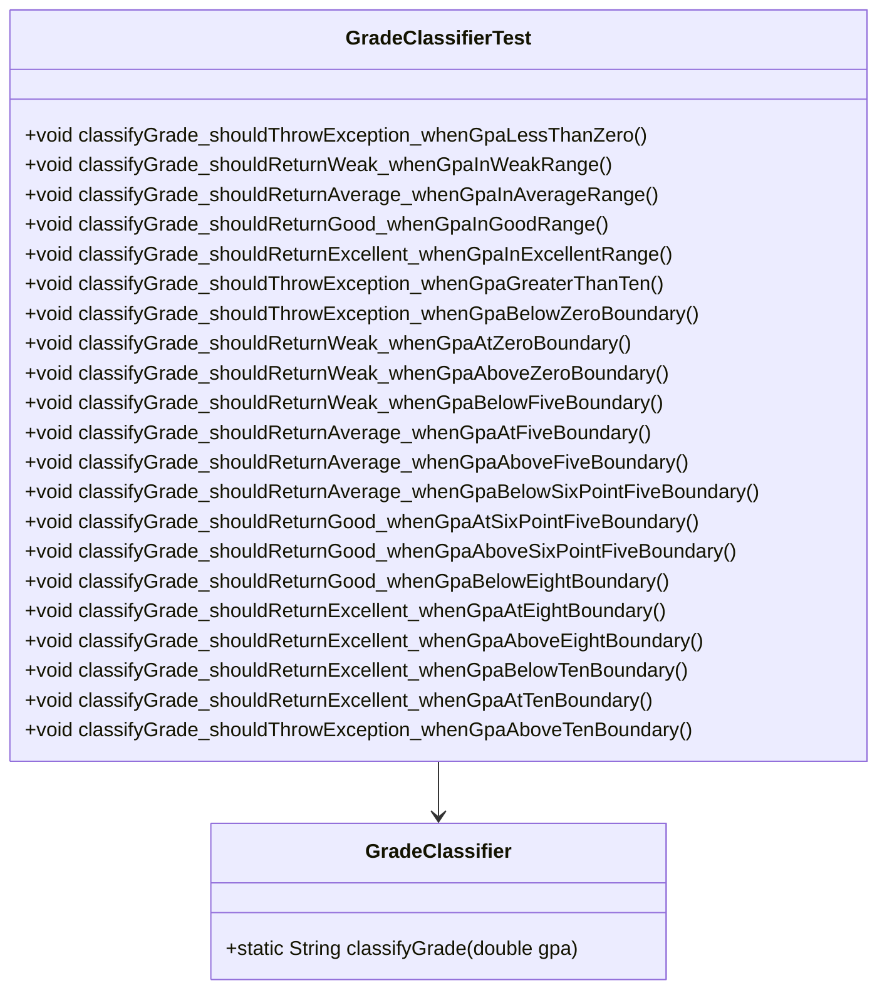

# Bài 3: The buggy trap

## 1. Tóm tắt ý tưởng chính của lời giải

Bài toán yêu cầu kiểm thử và sửa lỗi hàm:

```java
classifyGrade(double gpa)
```

trong class `GradeClassifier`.

Hàm này dùng để phân loại học lực dựa trên điểm GPA theo thang điểm 10.

Theo JavaDoc, quy tắc phân loại đúng là:

| Khoảng GPA | Kết quả |
|---|---|
| `[0.0, 5.0)` | `"Yếu"` |
| `[5.0, 6.5)` | `"Trung bình"` |
| `[6.5, 8.0)` | `"Khá"` |
| `[8.0, 10.0]` | `"Giỏi"` |
| Ngoài `[0.0, 10.0]` | Ném `IllegalArgumentException` |

Code ban đầu có lỗi ở xử lý biên `5.0` và `6.5`.

Cụ thể, code cũ dùng:

```java
if (gpa <= 5.0) return "Yếu";
if (gpa <= 6.5) return "Trung bình";
```

Trong khi theo JavaDoc:

- `gpa = 5.0` phải thuộc nhóm `"Trung bình"`, không phải `"Yếu"`.
- `gpa = 6.5` phải thuộc nhóm `"Khá"`, không phải `"Trung bình"`.

Bài làm thiết kế test case bằng:

- **Equivalence Partitioning (EP)**.
- **Boundary Value Analysis (BVA)**.
- JUnit test với `assertEquals`.
- JUnit test ngoại lệ với `assertThrows`.

Sau khi chạy test trên code lỗi, các test tại biên `5.0` và `6.5` bị fail. Sau đó sửa hàm `classifyGrade()` để toàn bộ test đều pass.

## 2. Thiết kế hệ thống

### Lớp `GradeClassifier`

```java
public class GradeClassifier
```

#### Vai trò

`GradeClassifier` là class chứa hàm phân loại học lực dựa trên GPA.

#### Phương thức chính

```java
public static String classifyGrade(double gpa)
```

#### Logic đúng theo JavaDoc

Nếu `gpa` nằm ngoài khoảng `[0.0, 10.0]`, hàm ném ngoại lệ:

```java
throw new IllegalArgumentException("GPA không hợp lệ: " + gpa);
```

Nếu hợp lệ, GPA được phân loại như sau:

```java
if (gpa < 5.0) return "Yếu";
if (gpa < 6.5) return "Trung bình";
if (gpa < 8.0) return "Khá";
return "Giỏi";
```

---

### Lớp `GradeClassifierTest`

```java
public class GradeClassifierTest
```

#### Vai trò

`GradeClassifierTest` chứa toàn bộ test case được thiết kế dựa trên JavaDoc.

Test class này kiểm tra:

- Các lớp tương đương của `gpa`.
- Các giá trị biên của `gpa`.
- Các trường hợp ngoại lệ khi `gpa < 0.0` hoặc `gpa > 10.0`.
- Nội dung thông báo lỗi khi có ngoại lệ.

#### Các assertion được dùng

```java
assertEquals(expected, actual)
```

Dùng để kiểm tra kết quả phân loại GPA.

```java
assertThrows(IllegalArgumentException.class, executable)
```

Dùng để kiểm tra hàm có ném đúng ngoại lệ khi GPA không hợp lệ.

## Sơ đồ lớp



## 3. Lý do lựa chọn hướng tiếp cận và ưu điểm

### Hướng tiếp cận

Bài làm chỉ dựa vào JavaDoc để thiết kế test case, không dựa vào code cài đặt ban đầu.

Cách làm này giúp test phản ánh đúng đặc tả thay vì bị ảnh hưởng bởi lỗi trong code.

Các bước thực hiện:

1. Đọc JavaDoc để xác định các khoảng GPA hợp lệ.
2. Chia lớp tương đương bằng EP.
3. Chọn các giá trị biên bằng BVA.
4. Viết test JUnit trong class `GradeClassifierTest`.
5. Chạy test với code ban đầu để phát hiện test fail.
6. Ghi nhận expected, actual và suy luận lỗi.
7. Sửa `classifyGrade()` theo đúng JavaDoc.
8. Thêm test ngoại lệ cho `gpa = -0.1` và `gpa = 10.1`.
9. Chạy lại để đảm bảo toàn bộ test pass.

### Ưu điểm

- Test được thiết kế theo đặc tả, không phụ thuộc vào code lỗi.
- EP giúp bao phủ các vùng giá trị chính.
- BVA giúp phát hiện lỗi ở ranh giới.
- JUnit giúp tự động hóa quá trình kiểm thử.
- `assertThrows` giúp kiểm tra rõ ràng các trường hợp ngoại lệ.
- Việc kiểm tra message lỗi giúp đảm bảo ngoại lệ không chỉ đúng loại mà còn đúng nội dung.

### Kiến thức rút ra

Qua bài này có thể rút ra các kiến thức chính:

- Test case nên được thiết kế từ yêu cầu hoặc JavaDoc.
- Các lỗi thường xuất hiện ở giá trị biên.
- Dùng sai `<`, `<=` có thể làm sai phân loại tại ranh giới.
- EP phù hợp để chọn đại diện cho từng vùng dữ liệu.
- BVA phù hợp để phát hiện lỗi ở điểm chuyển tiếp giữa các vùng.
- `assertThrows` dùng để kiểm thử ngoại lệ trong JUnit.

## 4. Ví dụ

### Không có input từ người dùng

Chương trình không nhập dữ liệu từ bàn phím.

Dữ liệu kiểm thử được viết trực tiếp trong class `GradeClassifierTest`.

---

### 4.1. Equivalence Partitioning

Dựa trên JavaDoc, các lớp tương đương của `gpa` là:

| Lớp | Khoảng giá trị | Kết quả mong đợi |
|---|---:|---|
| EP1 | `gpa < 0.0` | `IllegalArgumentException` |
| EP2 | `0.0 <= gpa < 5.0` | `"Yếu"` |
| EP3 | `5.0 <= gpa < 6.5` | `"Trung bình"` |
| EP4 | `6.5 <= gpa < 8.0` | `"Khá"` |
| EP5 | `8.0 <= gpa <= 10.0` | `"Giỏi"` |
| EP6 | `gpa > 10.0` | `IllegalArgumentException` |

#### Bảng test case EP

| Mã TC | Mô tả | gpa | Kết quả mong đợi |
|---|---|---:|---|
| EP01 | GPA nhỏ hơn 0 | `-1.0` | `IllegalArgumentException` |
| EP02 | GPA thuộc khoảng yếu | `3.0` | `"Yếu"` |
| EP03 | GPA thuộc khoảng trung bình | `5.5` | `"Trung bình"` |
| EP04 | GPA thuộc khoảng khá | `7.0` | `"Khá"` |
| EP05 | GPA thuộc khoảng giỏi | `9.0` | `"Giỏi"` |
| EP06 | GPA lớn hơn 10 | `11.0` | `IllegalArgumentException` |

---

### 4.2. Boundary Value Analysis

Các ranh giới quan trọng là:

```text
0.0
5.0
6.5
8.0
10.0
```

Chọn giá trị ngay dưới, tại và ngay trên mỗi biên.

#### Bảng test case BVA

| Mã TC | Mô tả | gpa | Kết quả mong đợi |
|---|---|---:|---|
| BVA01 | Ngay dưới 0.0 | `-0.1` | `IllegalArgumentException` |
| BVA02 | Tại 0.0 | `0.0` | `"Yếu"` |
| BVA03 | Ngay trên 0.0 | `0.1` | `"Yếu"` |
| BVA04 | Ngay dưới 5.0 | `4.9` | `"Yếu"` |
| BVA05 | Tại 5.0 | `5.0` | `"Trung bình"` |
| BVA06 | Ngay trên 5.0 | `5.1` | `"Trung bình"` |
| BVA07 | Ngay dưới 6.5 | `6.4` | `"Trung bình"` |
| BVA08 | Tại 6.5 | `6.5` | `"Khá"` |
| BVA09 | Ngay trên 6.5 | `6.6` | `"Khá"` |
| BVA10 | Ngay dưới 8.0 | `7.9` | `"Khá"` |
| BVA11 | Tại 8.0 | `8.0` | `"Giỏi"` |
| BVA12 | Ngay trên 8.0 | `8.1` | `"Giỏi"` |
| BVA13 | Ngay dưới 10.0 | `9.9` | `"Giỏi"` |
| BVA14 | Tại 10.0 | `10.0` | `"Giỏi"` |
| BVA15 | Ngay trên 10.0 | `10.1` | `IllegalArgumentException` |

---

### 4.3. Các test bị fail với code ban đầu

Code ban đầu:

```java
if (gpa <= 5.0) return "Yếu";
if (gpa <= 6.5) return "Trung bình";
if (gpa < 8.0)  return "Khá";
return "Giỏi";
```

Với code này, các test sau sẽ fail:

| Test | gpa | Expected | Actual | Nguyên nhân |
|---|---:|---|---|---|
| BVA05 | `5.0` | `"Trung bình"` | `"Yếu"` | Code dùng `gpa <= 5.0` |
| BVA08 | `6.5` | `"Khá"` | `"Trung bình"` | Code dùng `gpa <= 6.5` |

Lỗi nằm ở điều kiện biên.

Code dùng `<=` tại `5.0` và `6.5`, trong khi JavaDoc yêu cầu hai mốc này thuộc khoảng phía sau.

---

### 4.4. Code đúng sau khi sửa

Code đúng là:

```java
public class GradeClassifier {

    /**
     * Phân loại học lực dựa trên điểm GPA (thang 10).
     *   [0.0, 5.0)  → "Yếu"
     *   [5.0, 6.5)  → "Trung bình"
     *   [6.5, 8.0)  → "Khá"
     *   [8.0, 10.0] → "Giỏi"
     *   Ngoài [0.0, 10.0]: ném IllegalArgumentException
     */
    public static String classifyGrade(double gpa) {
        if (gpa < 0.0 || gpa > 10.0) {
            throw new IllegalArgumentException("GPA không hợp lệ: " + gpa);
        }

        if (gpa < 5.0) {
            return "Yếu";
        }

        if (gpa < 6.5) {
            return "Trung bình";
        }

        if (gpa < 8.0) {
            return "Khá";
        }

        return "Giỏi";
    }
}
```

---

### 4.5. Ví dụ test ngoại lệ

Theo yêu cầu đề bài, sau khi sửa cần thêm test ngoại lệ cho:

```text
gpa = -0.1
gpa = 10.1
```

và kiểm tra cả nội dung thông báo lỗi.

Ví dụ:

```java
@Test
void classifyGrade_shouldThrowException_whenGpaIsMinusZeroPointOne() {
    IllegalArgumentException exception = assertThrows(
            IllegalArgumentException.class,
            () -> GradeClassifier.classifyGrade(-0.1)
    );

    assertEquals("GPA không hợp lệ: -0.1", exception.getMessage());
}
```

```java
@Test
void classifyGrade_shouldThrowException_whenGpaIsTenPointOne() {
    IllegalArgumentException exception = assertThrows(
            IllegalArgumentException.class,
            () -> GradeClassifier.classifyGrade(10.1)
    );

    assertEquals("GPA không hợp lệ: 10.1", exception.getMessage());
}
```

### Output mong đợi sau khi sửa

Khi chạy:

```bash
mvn test
```

kết quả mong đợi:

```text
Tests run: 21, Failures: 0, Errors: 0, Skipped: 0
BUILD SUCCESS
```

Nếu tách thêm 2 test ngoại lệ riêng dù đã có trong BVA, tổng số test có thể là `23`. Khi đó kết quả mong đợi là:

```text
Tests run: 23, Failures: 0, Errors: 0, Skipped: 0
BUILD SUCCESS
```

## 5. Kết luận

Bài toán minh họa một lỗi phổ biến trong kiểm thử: lỗi tại giá trị biên.

Dù code ban đầu có vẻ đúng với các giá trị thông thường như `3.0`, `5.5`, `7.0`, `9.0`, nhưng bị sai tại hai mốc quan trọng:

- `gpa = 5.0`
- `gpa = 6.5`

Nhờ áp dụng BVA, lỗi được phát hiện rõ ràng.

Sau khi sửa điều kiện:

```java
if (gpa < 5.0) return "Yếu";
if (gpa < 6.5) return "Trung bình";
```

hàm `classifyGrade()` hoạt động đúng theo JavaDoc và toàn bộ test case đều pass.

## 6. Cách chạy chương trình

### Cấu trúc thư mục

Project nên có cấu trúc Maven như sau:

```text
Bai09/
├── pom.xml
├── README.md
├── run.sh
└── src/
    ├── main/
    │   └── java/
    │       └── GradeClassifier.java
    └── test/
        └── java/
            └── GradeClassifierTest.java
```

### File `pom.xml`

Project sử dụng Maven và JUnit 5.

Dependency chính cần có:

```xml
<dependency>
    <groupId>org.junit.jupiter</groupId>
    <artifactId>junit-jupiter</artifactId>
    <version>5.10.5</version>
    <scope>test</scope>
</dependency>
```

### Chạy test bằng Maven

Từ thư mục `Bai09`, chạy:

```bash
mvn test
```

### Chạy bằng `run.sh`

Nội dung file `run.sh`:

```bash
#!/bin/bash

mvn test
```

Cấp quyền thực thi:

```bash
chmod +x run.sh
```

Chạy script:

```bash
./run.sh
```

### Lỗi thường gặp

Nếu gặp lỗi:

```text
cannot find symbol
symbol: variable GradeClassifier
location: class GradeClassifierTest
```

hãy kiểm tra file `GradeClassifier.java` đã được đặt đúng vị trí chưa:

```text
src/main/java/GradeClassifier.java
```

và tên class bên trong phải đúng là:

```java
public class GradeClassifier
```

Nếu file đang đặt trong `src/test/java`, `src/`, hoặc đặt nhầm tên `Main.java`, Maven sẽ không tìm thấy class `GradeClassifier` khi compile test.
