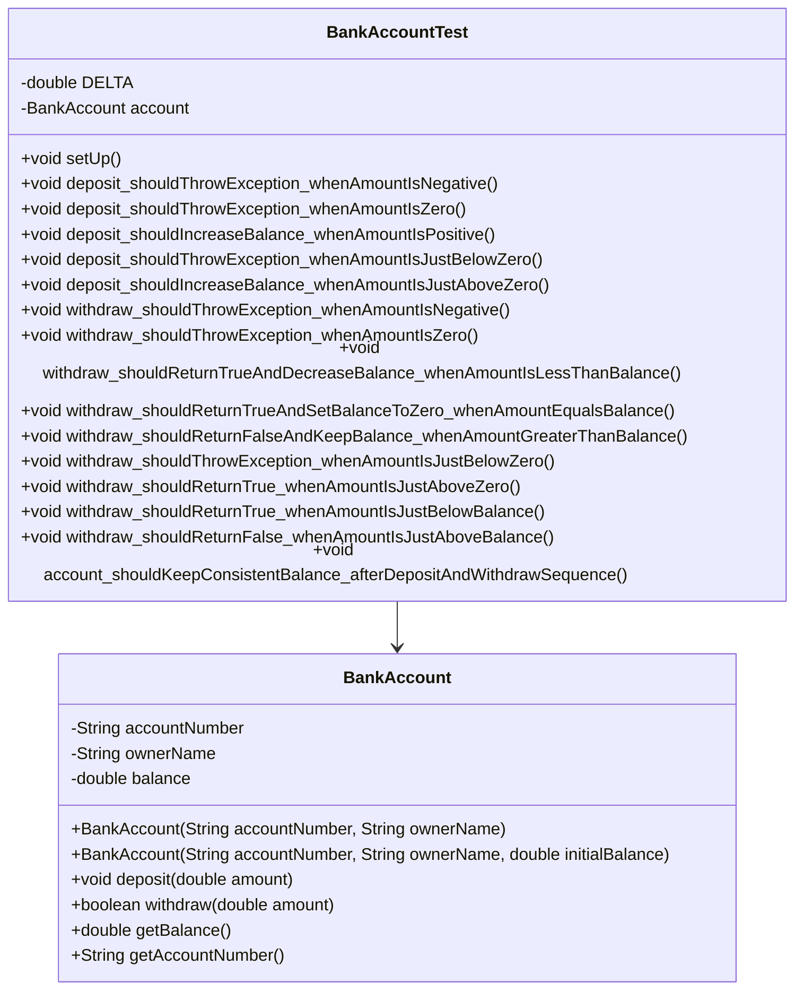

# Bài 4: The bank account tester

## 1. Tóm tắt ý tưởng chính của lời giải

Bài toán yêu cầu kiểm thử class `BankAccount` bằng JUnit.

Class `BankAccount` mô phỏng một tài khoản ngân hàng đơn giản, gồm các chức năng chính:

- Tạo tài khoản với số dư mặc định là `0.0`.
- Tạo tài khoản với số dư ban đầu.
- Nạp tiền bằng `deposit(double amount)`.
- Rút tiền bằng `withdraw(double amount)`.
- Xem số dư bằng `getBalance()`.
- Xem số tài khoản bằng `getAccountNumber()`.

Trọng tâm bài kiểm thử là hai phương thức:

```java
deposit(double amount)
```

và:

```java
withdraw(double amount)
```

Bài làm thiết kế test case bằng:

- **Equivalence Partitioning (EP)** cho `deposit()` và `withdraw()`.
- **Boundary Value Analysis (BVA)** cho `deposit()` và `withdraw()`.
- JUnit test với số dư ban đầu là `500` trước mỗi test.
- Một test kiểm tra tính nhất quán số dư theo chuỗi thao tác:
  - Số dư ban đầu `0`
  - Nạp `500`
  - Rút `200` thành công
  - Rút `400` thất bại
  - Số dư cuối cùng phải là `300`

## 2. Thiết kế hệ thống

### Lớp `BankAccount`

```java
public class BankAccount
```

#### Thuộc tính

- `accountNumber`: số tài khoản.
- `ownerName`: tên chủ tài khoản.
- `balance`: số dư hiện tại.

#### Vai trò

`BankAccount` đại diện cho một tài khoản ngân hàng.

Lớp này chịu trách nhiệm:

- Lưu thông tin tài khoản.
- Lưu số dư.
- Xử lý nạp tiền.
- Xử lý rút tiền.
- Cung cấp số dư hiện tại.

---

### Constructor không có số dư ban đầu

```java
public BankAccount(String accountNumber, String ownerName)
```

#### Logic xử lý

Constructor này tạo tài khoản mới với số dư mặc định:

```java
this.balance = 0.0;
```

---

### Constructor có số dư ban đầu

```java
public BankAccount(String accountNumber, String ownerName, double initialBalance)
```

#### Logic xử lý

Nếu `initialBalance < 0`, chương trình in thông báo lỗi ra `System.err` và gán số dư mặc định là `0.0`.

```java
if (initialBalance < 0) {
    System.err.println("Số dư ban đầu không hợp lệ. Gán mặc định là 0.");
    this.balance = 0.0;
}
```

Nếu `initialBalance >= 0`, số dư được gán bằng giá trị truyền vào.

---

### Phương thức `deposit`

```java
public void deposit(double amount)
```

#### Vai trò

Nạp tiền vào tài khoản.

#### Logic xử lý

Nếu `amount <= 0`, hàm ném ngoại lệ:

```java
throw new IllegalArgumentException("Số tiền nạp phải lớn hơn 0.");
```

Nếu `amount > 0`, số dư tăng thêm `amount`:

```java
this.balance += amount;
```

---

### Phương thức `withdraw`

```java
public boolean withdraw(double amount)
```

#### Vai trò

Rút tiền khỏi tài khoản.

#### Logic xử lý

Nếu `amount <= 0`, hàm ném ngoại lệ:

```java
throw new IllegalArgumentException("Số tiền rút phải lớn hơn 0.");
```

Nếu `amount > balance`, hàm trả về `false` và số dư không thay đổi.

Nếu `0 < amount <= balance`, hàm trừ số tiền rút khỏi số dư và trả về `true`.

---

### Lớp `BankAccountTest`

```java
public class BankAccountTest
```

#### Vai trò

`BankAccountTest` chứa toàn bộ test case kiểm thử class `BankAccount`.

#### Các annotation JUnit được sử dụng

```java
@BeforeEach
```

Chạy trước mỗi test case để tạo mới tài khoản với số dư ban đầu là `500`.

```java
@Test
```

Đánh dấu một phương thức là test case.

#### Các assertion được sử dụng

```java
assertEquals(expected, actual, DELTA)
```

Dùng để kiểm tra số dư kiểu `double`.

```java
assertTrue(result)
```

Dùng để kiểm tra thao tác rút tiền thành công.

```java
assertFalse(result)
```

Dùng để kiểm tra thao tác rút tiền thất bại.

```java
assertThrows(IllegalArgumentException.class, executable)
```

Dùng để kiểm tra ngoại lệ khi nạp hoặc rút số tiền không hợp lệ.

## Sơ đồ lớp



## 3. Lý do lựa chọn hướng tiếp cận và ưu điểm

### Hướng tiếp cận

Bài làm dùng JUnit 5 để kiểm thử tự động các chức năng của `BankAccount`.

Các test được thiết kế theo hai kỹ thuật chính:

1. **Equivalence Partitioning**

   Chia dữ liệu đầu vào thành các lớp tương đương như:

   - Số tiền âm.
   - Số tiền bằng `0`.
   - Số tiền dương hợp lệ.
   - Số tiền rút nhỏ hơn số dư.
   - Số tiền rút bằng số dư.
   - Số tiền rút lớn hơn số dư.

2. **Boundary Value Analysis**

   Kiểm tra các giá trị sát biên quan trọng:

   - Biên `amount = 0`.
   - Biên `amount = balance`.

Ngoài ra, bài còn có test theo chuỗi thao tác để kiểm tra tính nhất quán của số dư sau nhiều lần nạp và rút.

### Ưu điểm

- Test rõ ràng, chia nhóm theo từng chức năng.
- Bao phủ cả trường hợp hợp lệ và không hợp lệ.
- Kiểm tra được ngoại lệ khi dữ liệu đầu vào sai.
- Kiểm tra được trạng thái số dư sau mỗi thao tác.
- Sử dụng `@BeforeEach` giúp mỗi test độc lập với nhau.
- Dùng `DELTA` khi so sánh số thực giúp tránh lỗi so sánh `double`.

### Kiến thức rút ra

Qua bài này có thể rút ra các kiến thức chính:

- Cách viết unit test bằng JUnit 5.
- Cách dùng `@BeforeEach` để chuẩn bị dữ liệu trước mỗi test.
- Cách dùng `assertEquals()` với số thực.
- Cách dùng `assertThrows()` để kiểm tra ngoại lệ.
- Cách dùng `assertTrue()` và `assertFalse()` để kiểm tra kết quả boolean.
- Cách thiết kế test case theo EP và BVA.
- Cách kiểm tra tính nhất quán trạng thái của object sau nhiều thao tác.

## 4. Ví dụ

### Không có input từ người dùng

Chương trình không nhập dữ liệu từ bàn phím.

Dữ liệu test được viết trực tiếp trong class `BankAccountTest`.

Trước mỗi test, tài khoản được tạo với số dư ban đầu là `500`:

```java
@BeforeEach
void setUp() {
    account = new BankAccount("ACC001", "Nguyen Van A", 500.0);
}
```

---

### 4.1. Test case cho `deposit(double amount)`

#### Equivalence Partitioning

Với phương thức:

```java
deposit(double amount)
```

các lớp tương đương là:

| Lớp | Điều kiện | Ý nghĩa | Kết quả mong đợi |
|---|---:|---|---|
| DEP_EP1 | `amount < 0` | Số tiền nạp âm | Ném `IllegalArgumentException` |
| DEP_EP2 | `amount = 0` | Số tiền nạp bằng 0 | Ném `IllegalArgumentException` |
| DEP_EP3 | `amount > 0` | Số tiền nạp hợp lệ | Số dư tăng thêm `amount` |

#### Bảng test case EP cho `deposit`

| Mã TC | Mô tả | Balance ban đầu | amount | Kết quả mong đợi |
|---|---|---:|---:|---|
| DEP_EP_01 | Nạp số tiền âm | `500` | `-100` | Ném `IllegalArgumentException` |
| DEP_EP_02 | Nạp số tiền bằng 0 | `500` | `0` | Ném `IllegalArgumentException` |
| DEP_EP_03 | Nạp số tiền hợp lệ | `500` | `200` | Balance = `700` |

---

#### Boundary Value Analysis

Biên quan trọng của `deposit()` là:

```text
amount = 0
```

Các giá trị biên:

| Dạng | amount | Kết quả mong đợi |
|---|---:|---|
| min- | `-0.01` | Ném `IllegalArgumentException` |
| min | `0` | Ném `IllegalArgumentException` |
| min+ | `0.01` | Balance = `500.01` |

#### Bảng test case BVA cho `deposit`

| Mã TC | Mô tả | Balance ban đầu | amount | Kết quả mong đợi |
|---|---|---:|---:|---|
| DEP_BVA_01 | Ngay dưới 0 | `500` | `-0.01` | Ném `IllegalArgumentException` |
| DEP_BVA_02 | Tại 0 | `500` | `0` | Ném `IllegalArgumentException` |
| DEP_BVA_03 | Ngay trên 0 | `500` | `0.01` | Balance = `500.01` |

---

### 4.2. Test case cho `withdraw(double amount)`

#### Equivalence Partitioning

Với phương thức:

```java
withdraw(double amount)
```

và số dư ban đầu là `500`, các lớp tương đương là:

| Lớp | Điều kiện | Ý nghĩa | Kết quả mong đợi |
|---|---:|---|---|
| WIT_EP1 | `amount < 0` | Số tiền rút âm | Ném `IllegalArgumentException` |
| WIT_EP2 | `amount = 0` | Số tiền rút bằng 0 | Ném `IllegalArgumentException` |
| WIT_EP3 | `0 < amount < balance` | Rút nhỏ hơn số dư | Trả `true`, balance giảm |
| WIT_EP4 | `amount = balance` | Rút toàn bộ số dư | Trả `true`, balance = `0` |
| WIT_EP5 | `amount > balance` | Rút vượt quá số dư | Trả `false`, balance không đổi |

#### Bảng test case EP cho `withdraw`

| Mã TC | Mô tả | Balance ban đầu | amount | Kết quả mong đợi |
|---|---|---:|---:|---|
| WIT_EP_01 | Rút số tiền âm | `500` | `-100` | Ném `IllegalArgumentException` |
| WIT_EP_02 | Rút số tiền bằng 0 | `500` | `0` | Ném `IllegalArgumentException` |
| WIT_EP_03 | Rút nhỏ hơn số dư | `500` | `200` | Trả `true`, balance = `300` |
| WIT_EP_04 | Rút bằng số dư | `500` | `500` | Trả `true`, balance = `0` |
| WIT_EP_05 | Rút lớn hơn số dư | `500` | `600` | Trả `false`, balance = `500` |

---

#### Boundary Value Analysis

Có hai biên quan trọng:

```text
amount = 0
amount = balance
```

Với `balance = 500`.

##### Biên `amount = 0`

| Dạng | amount | Kết quả mong đợi |
|---|---:|---|
| min- | `-0.01` | Ném `IllegalArgumentException` |
| min | `0` | Ném `IllegalArgumentException` |
| min+ | `0.01` | Trả `true`, balance = `499.99` |

##### Biên `amount = balance = 500`

| Dạng | amount | Kết quả mong đợi |
|---|---:|---|
| max- | `499.99` | Trả `true`, balance = `0.01` |
| max | `500` | Trả `true`, balance = `0` |
| max+ | `500.01` | Trả `false`, balance = `500` |

#### Bảng test case BVA cho `withdraw`

| Mã TC | Mô tả | Balance ban đầu | amount | Kết quả mong đợi |
|---|---|---:|---:|---|
| WIT_BVA_01 | Ngay dưới 0 | `500` | `-0.01` | Ném `IllegalArgumentException` |
| WIT_BVA_02 | Tại 0 | `500` | `0` | Ném `IllegalArgumentException` |
| WIT_BVA_03 | Ngay trên 0 | `500` | `0.01` | Trả `true`, balance = `499.99` |
| WIT_BVA_04 | Ngay dưới số dư | `500` | `499.99` | Trả `true`, balance = `0.01` |
| WIT_BVA_05 | Bằng số dư | `500` | `500` | Trả `true`, balance = `0` |
| WIT_BVA_06 | Ngay trên số dư | `500` | `500.01` | Trả `false`, balance = `500` |

---

### 4.3. Test kiểm tra tính nhất quán theo trình tự

Yêu cầu đề bài:

```text
Số dư ban đầu là 0
→ nạp 500
→ rút 200 thành công
→ rút 400 thất bại
→ kiểm tra số dư cuối phải đúng bằng 300
```

Code test:

```java
@Test
void account_shouldKeepConsistentBalance_afterDepositAndWithdrawSequence() {
    BankAccount sequenceAccount = new BankAccount("ACC002", "Tran Thi B");

    assertEquals(0.0, sequenceAccount.getBalance(), DELTA);

    sequenceAccount.deposit(500.0);
    assertEquals(500.0, sequenceAccount.getBalance(), DELTA);

    boolean firstWithdraw = sequenceAccount.withdraw(200.0);
    assertTrue(firstWithdraw);
    assertEquals(300.0, sequenceAccount.getBalance(), DELTA);

    boolean secondWithdraw = sequenceAccount.withdraw(400.0);
    assertFalse(secondWithdraw);
    assertEquals(300.0, sequenceAccount.getBalance(), DELTA);
}
```

Giải thích:

- Ban đầu tài khoản có `0`.
- Sau khi nạp `500`, số dư là `500`.
- Rút `200` thành công, số dư còn `300`.
- Rút `400` thất bại vì số dư chỉ còn `300`.
- Số dư cuối cùng vẫn là `300`.

---

### 4.4. Vì sao dùng `DELTA` khi so sánh `double`

Vì `balance` và `amount` là kiểu `double`, khi so sánh số thực trong JUnit nên dùng:

```java
assertEquals(expected, actual, DELTA);
```

Ví dụ:

```java
assertEquals(500.01, account.getBalance(), DELTA);
```

Trong đó:

```java
private static final double DELTA = 0.000001;
```

`DELTA` là sai số nhỏ được chấp nhận khi so sánh số thực.

---

### Output mong đợi khi chạy test

Khi chạy:

```bash
mvn test
```

kết quả mong đợi:

```text
Tests run: 15, Failures: 0, Errors: 0, Skipped: 0
BUILD SUCCESS
```

## 5. Kết luận

Bài toán đã kiểm thử class `BankAccount` bằng JUnit 5.

Bộ test bao phủ được:

- Nạp tiền âm.
- Nạp tiền bằng `0`.
- Nạp tiền hợp lệ.
- Nạp tiền ngay dưới và ngay trên biên `0`.
- Rút tiền âm.
- Rút tiền bằng `0`.
- Rút tiền hợp lệ.
- Rút toàn bộ số dư.
- Rút vượt quá số dư.
- Rút tiền ngay dưới, tại và ngay trên các biên quan trọng.
- Kiểm tra tính nhất quán của số dư sau chuỗi thao tác nạp và rút.

Nhờ đó, có thể xác nhận các hành vi chính của `BankAccount` hoạt động đúng theo yêu cầu.

## 6. Cách chạy chương trình

### Cấu trúc thư mục

Project nên có cấu trúc Maven như sau:

```text
Bai10/
├── pom.xml
├── README.md
├── run.sh
└── src/
    ├── main/
    │   └── java/
    │       └── BankAccount.java
    └── test/
        └── java/
            └── BankAccountTest.java
```

### File `pom.xml`

Project sử dụng Maven và JUnit 5.

Dependency chính cần có:

```xml
<dependency>
    <groupId>org.junit.jupiter</groupId>
    <artifactId>junit-jupiter</artifactId>
    <version>5.10.5</version>
    <scope>test</scope>
</dependency>
```

### Chạy test bằng Maven

Từ thư mục `Bai10`, chạy:

```bash
mvn test
```

### Chạy bằng `run.sh`

Nội dung file `run.sh`:

```bash
#!/bin/bash

mvn test
```

Cấp quyền thực thi:

```bash
chmod +x run.sh
```

Chạy script:

```bash
./run.sh
```

### Lỗi thường gặp

Nếu gặp lỗi:

```text
cannot find symbol
symbol: variable BankAccount
location: class BankAccountTest
```

hãy kiểm tra file `BankAccount.java` đã được đặt đúng vị trí chưa:

```text
src/main/java/BankAccount.java
```

và tên class bên trong phải đúng là:

```java
public class BankAccount
```

Nếu file đang đặt trong `src/test/java`, `src/`, hoặc đặt nhầm tên `Main.java`, Maven sẽ không tìm thấy class `BankAccount` khi compile test.
