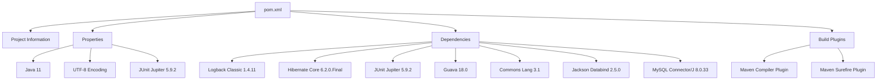

# Bài 1: Quản lý Dependency với Maven

## 1. Tóm tắt ý tưởng chính của lời giải

Bài tập yêu cầu nâng cấp cấu hình Maven cho dự án `MathUtils` đang sử dụng file `pom.xml` cũ. Mục tiêu chính là bổ sung các thư viện mới, thay thế thư viện kiểm thử cũ và xử lý các xung đột phát sinh để dự án có thể build thành công.

Các yêu cầu được xử lý gồm:

- Thêm `Logback Classic 1.4.11` để hỗ trợ logging có cấu trúc thay cho việc in thủ công bằng `System.out.println`.
- Thêm `Hibernate Core 6.2.0.Final` để chuẩn bị cho nhu cầu lưu trữ dữ liệu trong tương lai.
- Chuyển từ `JUnit 4` sang `JUnit Jupiter 5.9.2` làm công cụ kiểm thử duy nhất.
- Cập nhật cấu hình Maven Compiler và Maven Surefire Plugin để đảm bảo dự án build và chạy test ổn định.
- Sửa dependency MySQL Connector cũ sang artifact mới phù hợp hơn.

Giải pháp tập trung vào việc chỉnh sửa file `pom.xml`, vì đây là nơi Maven quản lý thông tin dự án, dependency, plugin build và cấu hình kiểm thử.

## 2. Thiết kế hệ thống

Dự án trong bài này chưa tập trung vào thiết kế class Java cụ thể, mà tập trung vào quản lý dependency bằng Maven. Vì vậy, thành phần quan trọng nhất là file `pom.xml`.

### File `pom.xml`

`pom.xml` là file cấu hình trung tâm của Maven, dùng để khai báo:

- Thông tin định danh dự án.
- Phiên bản Java dùng để biên dịch.
- Danh sách thư viện cần sử dụng.
- Plugin phục vụ quá trình build và test.

Các thông tin chính của dự án:

```xml
<groupId>com.practice.maven</groupId>
<artifactId>maven-lab-01</artifactId>
<version>1.0-SNAPSHOT</version>
```

### Cấu hình Java

Dự án ban đầu dùng Java 8:

```xml
<maven.compiler.source>1.8</maven.compiler.source>
<maven.compiler.target>1.8</maven.compiler.target>
```

Sau khi bổ sung `logback-classic 1.4.11` và `hibernate-core 6.2.0.Final`, cấu hình nên được nâng lên Java 11 để phù hợp hơn với các thư viện mới:

```xml
<maven.compiler.release>11</maven.compiler.release>
```

### Các dependency chính

#### Logback Classic

```xml
<dependency>
    <groupId>ch.qos.logback</groupId>
    <artifactId>logback-classic</artifactId>
    <version>1.4.11</version>
</dependency>
```

Vai trò:

- Cung cấp logging framework cho ứng dụng.
- Cho phép thay thế `System.out.println` bằng logger chuyên nghiệp hơn.
- Hỗ trợ ghi log theo nhiều cấp độ như `info`, `debug`, `warn`, `error`.

#### Hibernate Core

```xml
<dependency>
    <groupId>org.hibernate.orm</groupId>
    <artifactId>hibernate-core</artifactId>
    <version>6.2.0.Final</version>
</dependency>
```

Vai trò:

- Hỗ trợ ORM, giúp ánh xạ object Java với bảng trong cơ sở dữ liệu.
- Chuẩn bị cho nhu cầu lưu trữ dữ liệu trong tương lai.
- Với Hibernate 6, khi viết entity cần dùng namespace `jakarta.persistence` thay vì `javax.persistence`.

#### JUnit Jupiter

```xml
<dependency>
    <groupId>org.junit.jupiter</groupId>
    <artifactId>junit-jupiter</artifactId>
    <version>5.9.2</version>
    <scope>test</scope>
</dependency>
```

Vai trò:

- Thay thế hoàn toàn JUnit 4.
- Dùng để viết và chạy unit test cho dự án.
- Dependency này chỉ dùng trong phạm vi test nhờ `scope` là `test`.

#### MySQL Connector/J

Dependency cũ:

```xml
<groupId>mysql</groupId>
<artifactId>mysql-connector-java</artifactId>
<version>5.1.30</version>
```

Được thay bằng:

```xml
<groupId>com.mysql</groupId>
<artifactId>mysql-connector-j</artifactId>
<version>8.0.33</version>
```

Vai trò:

- Cung cấp driver để Java kết nối đến MySQL.
- Artifact mới phù hợp hơn với các phiên bản MySQL Connector/J hiện đại.

### Các plugin chính

#### Maven Compiler Plugin

```xml
<plugin>
    <groupId>org.apache.maven.plugins</groupId>
    <artifactId>maven-compiler-plugin</artifactId>
    <version>3.11.0</version>
    <configuration>
        <release>${maven.compiler.release}</release>
    </configuration>
</plugin>
```

Vai trò:

- Biên dịch source code Java.
- Đảm bảo dự án được build theo phiên bản Java đã khai báo.

#### Maven Surefire Plugin

```xml
<plugin>
    <groupId>org.apache.maven.plugins</groupId>
    <artifactId>maven-surefire-plugin</artifactId>
    <version>3.1.2</version>
</plugin>
```

Vai trò:

- Chạy unit test khi thực hiện lệnh `mvn test`.
- Hỗ trợ tốt JUnit Jupiter.
- Giúp Maven nhận diện và thực thi các test viết bằng JUnit 5.

## Sơ đồ cấu hình Maven



## 3. Lý do lựa chọn hướng tiếp cận và ưu điểm

### Hướng tiếp cận

Hướng giải quyết là cập nhật trực tiếp file `pom.xml`, vì đây là file quản lý toàn bộ dependency và plugin của dự án Maven.

Các bước chính:

1. Xóa dependency JUnit 4 cũ.
2. Thêm JUnit Jupiter 5.9.2.
3. Thêm Logback Classic 1.4.11.
4. Thêm Hibernate Core 6.2.0.Final.
5. Cập nhật MySQL Connector sang artifact mới.
6. Nâng cấu hình compiler lên Java 11.
7. Thêm Maven Surefire Plugin để chạy JUnit Jupiter.

### Ưu điểm

- Cấu hình Maven rõ ràng, dễ bảo trì.
- Dự án sử dụng duy nhất JUnit Jupiter, tránh xung đột giữa JUnit 4 và JUnit 5.
- Logging được chuẩn hóa bằng Logback thay vì dùng `System.out.println`.
- Dự án sẵn sàng mở rộng thêm chức năng lưu trữ dữ liệu nhờ Hibernate.
- Quá trình chạy test ổn định hơn nhờ Maven Surefire Plugin phiên bản mới.
- Cấu hình Java 11 phù hợp hơn với các dependency hiện đại.

### Kiến thức rút ra

Qua bài này có thể rút ra một số kiến thức quan trọng:

- Maven quản lý dependency thông qua file `pom.xml`.
- Khi thay đổi dependency lớn, cần kiểm tra khả năng tương thích với phiên bản Java.
- JUnit Jupiter không nên dùng chung với JUnit 4 nếu yêu cầu bài là chuyển hẳn sang JUnit 5.
- Hibernate 6 sử dụng `jakarta.persistence`, khác với các phiên bản cũ dùng `javax.persistence`.
- Maven Surefire Plugin cần được cấu hình phù hợp để chạy test bằng JUnit Jupiter.

## 4. Ví dụ

Bài này không yêu cầu nhập dữ liệu từ người dùng. Nội dung cần kiểm tra là quá trình Maven build và chạy test.

### Lệnh kiểm tra

```bash
mvn clean test
```

### Kết quả mong đợi

Nếu cấu hình đúng, Maven sẽ:

- Tải các dependency được khai báo trong `pom.xml`.
- Biên dịch source code bằng Java 11.
- Chạy các test JUnit Jupiter.
- Kết thúc quá trình build với trạng thái thành công.

Ví dụ kết quả mong đợi:

```text
[INFO] BUILD SUCCESS
```

### Ví dụ chuyển đổi test từ JUnit 4 sang JUnit Jupiter

JUnit 4 cũ:

```java
import org.junit.Test;
import static org.junit.Assert.assertEquals;
```

JUnit Jupiter mới:

```java
import org.junit.jupiter.api.Test;
import static org.junit.jupiter.api.Assertions.assertEquals;
```

## 5. Kết luận

Bài tập đã nâng cấp cấu hình Maven của dự án `MathUtils` từ cấu hình cũ sang cấu hình phù hợp hơn với các yêu cầu mới.

Các thay đổi quan trọng gồm:

- Thêm Logback Classic để hỗ trợ logging.
- Thêm Hibernate Core để chuẩn bị cho chức năng lưu trữ dữ liệu.
- Thay JUnit 4 bằng JUnit Jupiter.
- Cập nhật plugin compiler và surefire.
- Điều chỉnh Java version để tránh lỗi tương thích.
- Cập nhật MySQL Connector/J sang artifact mới.

Sau khi hoàn thành, dự án có cấu hình Maven rõ ràng hơn, dễ mở rộng hơn và sẵn sàng cho các bước phát triển tiếp theo.

## 6. Cách chạy chương trình

### Yêu cầu môi trường

Cần cài đặt:

- Java 11 hoặc mới hơn.
- Maven.

Kiểm tra phiên bản Java:

```bash
java -version
```

Kiểm tra phiên bản Maven:

```bash
mvn -version
```

### Cách build dự án

Tại thư mục chứa file `pom.xml`, chạy:

```bash
mvn clean compile
```

### Cách chạy test

```bash
mvn clean test
```

### Cách đóng gói dự án

```bash
mvn clean package
```

Nếu quá trình chạy thành công, Maven sẽ hiển thị:

```text
[INFO] BUILD SUCCESS
```
