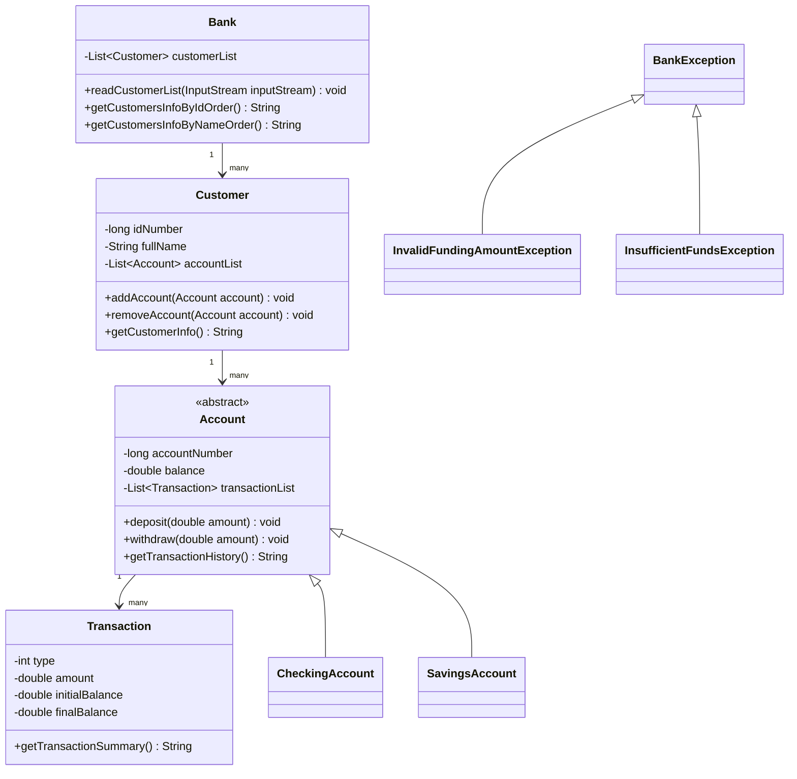

# Bài 2: Code Quality - Checkstyle

## 1. Tóm tắt ý tưởng chính của lời giải

Bài làm refactor dự án `BankSystem` cũ để cải thiện chất lượng mã nguồn, chuẩn hóa phong cách code và bổ sung khả năng quan sát hoạt động hệ thống thông qua logging.

Các thay đổi chính:

- Tích hợp `maven-checkstyle-plugin` vào lifecycle Maven ở phase `validate`.
- Áp dụng bộ quy tắc `google_checks.xml` để kiểm tra định dạng, đặt tên, import, Javadoc và độ dài dòng.
- Refactor các class Java để giảm lỗi style và lỗi thiết kế như wildcard import, tên biến khó hiểu, magic number, catch `Exception` quá rộng, cộng chuỗi trong vòng lặp và logging bằng `System.out.println`.
- Thay thế log thủ công bằng SLF4J kết hợp Logback.

## 2. Thiết kế hệ thống

### `Bank`

Lớp quản lý danh sách khách hàng và đọc dữ liệu khách hàng/tài khoản từ `InputStream`.

Vai trò chính:

- Lưu danh sách `Customer`.
- Đọc dữ liệu khách hàng và tài khoản.
- Sắp xếp khách hàng theo số CMND hoặc họ tên.
- Ghi log quá trình đọc dữ liệu, thêm khách hàng, thêm tài khoản và các dòng dữ liệu lỗi.

Các điểm đã refactor:

- Đổi `c_list` thành `customerList`.
- Thay wildcard import bằng import cụ thể.
- Tách logic đọc dữ liệu thành các hàm nhỏ như `readLines`, `parseCustomer`, `addAccountToCustomer`, `createAccount`.
- Dùng `StringBuilder` thay cho cộng chuỗi trong vòng lặp.
- Dùng `LOGGER.info`, `LOGGER.warn`, `LOGGER.error` thay cho `System.out.println`.

### `Customer`

Lớp biểu diễn khách hàng trong hệ thống ngân hàng.

Thuộc tính chính:

- `idNumber`: số CMND hoặc mã định danh khách hàng.
- `fullName`: họ tên khách hàng.
- `accountList`: danh sách tài khoản của khách hàng.

Vai trò chính:

- Thêm hoặc xóa tài khoản.
- Trả về thông tin khách hàng dạng text.
- Đảm bảo danh sách tài khoản không bị null.

### `Account`

Lớp trừu tượng đại diện cho tài khoản ngân hàng.

Thuộc tính chính:

- `accountNumber`: số tài khoản.
- `balance`: số dư.
- `transactionList`: lịch sử giao dịch.

Vai trò chính:

- Định nghĩa hai hành vi trừu tượng `deposit` và `withdraw`.
- Cung cấp logic chung cho nạp tiền và rút tiền qua `doDepositing` và `doWithdrawing`.
- Lưu lịch sử giao dịch.
- Ghi log debug khi lấy lịch sử giao dịch.

Các điểm đã refactor:

- Đổi tên hằng số sang chuẩn `UPPER_SNAKE_CASE`: `CHECKING_TYPE`, `SAVINGS_TYPE`.
- Đổi tên biến `_accNum`, `B`, `list` thành tên rõ nghĩa.
- Thay `Exception` chung bằng `BankException`.
- Bổ sung dấu ngoặc nhọn cho các khối điều kiện.
- Dùng `Objects.hash` cho `hashCode`.

### `CheckingAccount`

Lớp tài khoản vãng lai, kế thừa từ `Account`.

Vai trò chính:

- Xử lý nạp tiền vào tài khoản vãng lai.
- Xử lý rút tiền từ tài khoản vãng lai.
- Tạo giao dịch tương ứng bằng các hằng số trong `Transaction`.
- Ghi log khi giao dịch thành công hoặc thất bại.

### `SavingsAccount`

Lớp tài khoản tiết kiệm, kế thừa từ `Account`.

Vai trò chính:

- Xử lý nạp tiền vào tài khoản tiết kiệm.
- Xử lý rút tiền từ tài khoản tiết kiệm.
- Kiểm tra giới hạn rút tiền tối đa và số dư tối thiểu còn lại.

Các hằng số nghiệp vụ:

- `MAX_WITHDRAW_AMOUNT = 1000.0`
- `MIN_REMAINING_BALANCE = 5000.0`

Các điểm đã refactor:

- Thay magic number bằng hằng số.
- Đổi tên biến ngắn như `a`, `iB`, `fB` thành tên rõ nghĩa hơn trong logic xử lý.
- Thay `System.out.println` và `System.err.println` bằng logging có cấp độ.
- Tách logic kiểm tra rút tiền tiết kiệm vào `validateSavingsWithdrawal`.

### `Transaction`

Lớp biểu diễn một giao dịch ngân hàng.

Thuộc tính chính:

- `type`: loại giao dịch.
- `amount`: số tiền giao dịch.
- `initialBalance`: số dư trước giao dịch.
- `finalBalance`: số dư sau giao dịch.

Vai trò chính:

- Lưu thông tin giao dịch.
- Chuyển loại giao dịch thành chuỗi mô tả tiếng Việt.
- Trả về tóm tắt giao dịch.

Các điểm đã refactor:

- Đổi `get_type_string` thành `getTypeString`.
- Đổi tham số `t` thành `type`.
- Thay magic number trong `switch` bằng hằng số.
- Dùng `String.format` rõ ràng, tránh một dòng code quá dài.

### `BankException`

Ngoại lệ cha cho các lỗi nghiệp vụ trong hệ thống ngân hàng.

### `InvalidFundingAmountException`

Ngoại lệ dùng khi số tiền giao dịch không hợp lệ, ví dụ nhỏ hơn hoặc bằng 0.

### `InsufficientFundsException`

Ngoại lệ dùng khi số dư tài khoản không đủ để thực hiện giao dịch.

## Sơ đồ lớp



## 3. Lý do lựa chọn hướng tiếp cận và ưu điểm

### Hướng tiếp cận

Bài làm chọn hướng refactor từng nhóm lỗi:

1. Chuẩn hóa cấu trúc Maven và thêm Checkstyle vào quy trình build.
2. Chuẩn hóa định dạng code theo Google Java Style.
3. Cải thiện thiết kế bằng cách tách hàm, đặt tên rõ nghĩa và thay magic number bằng hằng số.
4. Thay logging thủ công bằng SLF4J và Logback.

### Ưu điểm

- Code dễ đọc và dễ bảo trì hơn.
- Maven có thể tự động phát hiện vi phạm style qua lệnh `mvn checkstyle:check`.
- Logging có cấu trúc hơn, dễ lọc theo cấp độ `DEBUG`, `INFO`, `WARN`, `ERROR`.
- Giảm lỗi tiềm ẩn do import thừa, tên biến khó hiểu, exception quá chung và logic lồng nhau phức tạp.
- Dễ mở rộng thêm loại tài khoản hoặc quy tắc giao dịch mới.

### Kiến thức rút ra

- Cách tích hợp Maven Checkstyle Plugin vào dự án Java.
- Cách áp dụng Google Java Style cho dự án.
- Cách refactor code để giảm code smell.
- Cách dùng SLF4J làm logging facade và Logback làm logging implementation.
- Cách chọn logging level phù hợp trong ứng dụng.

## 4. Logging levels và điểm dữ liệu được ghi lại

### `DEBUG`

Dùng cho thông tin chi tiết phục vụ debug, không cần hiển thị thường xuyên.

Ví dụ:

- Khi lấy lịch sử giao dịch của một tài khoản.

### `INFO`

Dùng cho các sự kiện nghiệp vụ bình thường và thành công.

Ví dụ:

- Bắt đầu đọc dữ liệu khách hàng.
- Thêm khách hàng thành công.
- Thêm tài khoản thành công.
- Nạp hoặc rút tiền thành công.

### `WARN`

Dùng cho tình huống bất thường nhưng chương trình vẫn có thể tiếp tục chạy.

Ví dụ:

- Dòng dữ liệu tài khoản sai định dạng.
- Loại tài khoản không được hỗ trợ.
- Giao dịch nạp/rút tiền không hợp lệ.

### `ERROR`

Dùng cho lỗi nghiêm trọng khi thao tác chính thất bại.

Ví dụ:

- Không đọc được dữ liệu khách hàng từ `InputStream`.

## 5. Ví dụ

### Ví dụ kiểm tra Checkstyle

Chạy lệnh:

```bash
mvn checkstyle:check
```

Nếu code đạt chuẩn, Maven sẽ build thành công. Nếu còn lỗi style, Maven sẽ báo lỗi và chỉ ra file, dòng và loại vi phạm.

### Ví dụ log mong đợi

Khi đọc dữ liệu và thêm khách hàng/tài khoản thành công, chương trình có thể ghi log theo dạng:

```text
2026-05-10 10:00:00 INFO  [main] bank_system.Bank - Start reading customer data
2026-05-10 10:00:00 INFO  [main] bank_system.Bank - Added customer Nguyen Van A
2026-05-10 10:00:00 INFO  [main] bank_system.Bank - Added CHECKING account 123456789
```

## 6. Kết luận

Bài làm đã cải thiện dự án `BankSystem` theo hướng chuyên nghiệp hơn bằng cách tích hợp Checkstyle, refactor mã nguồn theo chuẩn Google Java Style và thay thế logging thủ công bằng SLF4J/Logback. Nhờ đó, dự án có cấu trúc rõ ràng hơn, dễ kiểm tra chất lượng code hơn và dễ quan sát hoạt động khi chạy hệ thống.

## 7. Cách chạy chương trình

### Kiểm tra style bằng Checkstyle

```bash
mvn checkstyle:check
```

### Build dự án

```bash
mvn clean package
```

### Chạy kiểm tra toàn bộ quy trình build

```bash
mvn clean verify
```

Lưu ý: Dự án hiện là bộ class nghiệp vụ, chưa có class `Main` riêng để chạy trực tiếp từ dòng lệnh. Nếu muốn chạy demo, có thể bổ sung một class `Main` để khởi tạo `Bank`, đọc dữ liệu mẫu và gọi các phương thức nghiệp vụ.
