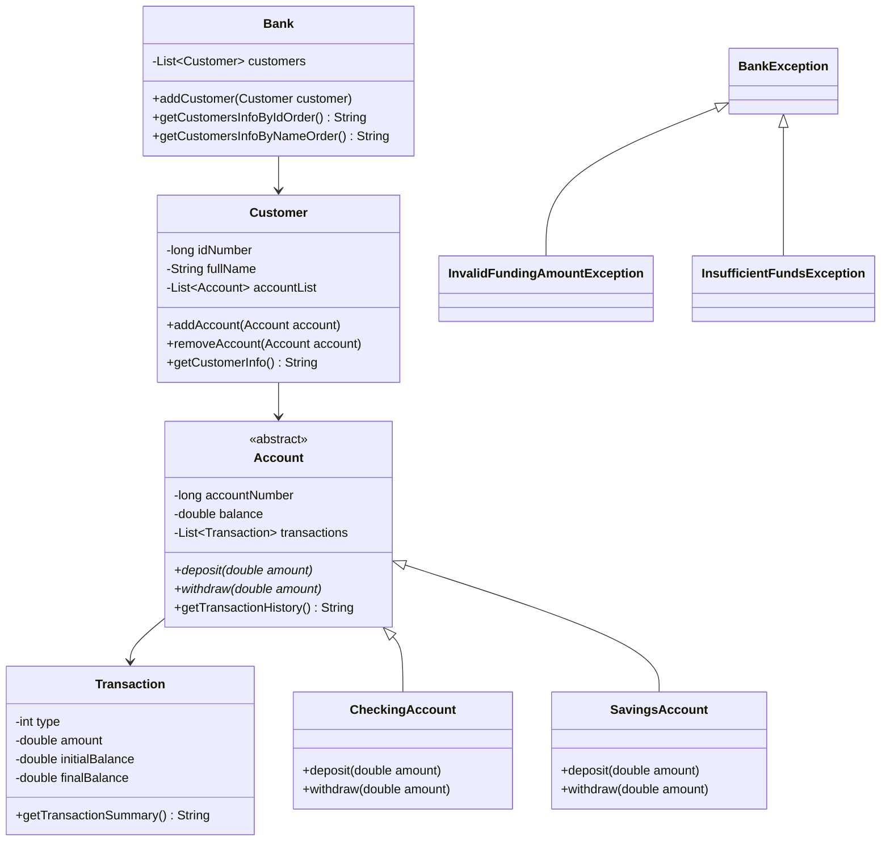

# Bai 5: Test Coverage & Quality Enforcement (JaCoCo)

## 1. Tom tat y tuong chinh cua loi giai

Bai nay bo sung co che do luong do bao phu test cho du an Maven bang JaCoCo. Khi chay `mvn clean verify`, Maven se:

1. Bien dich source code.
2. Chay Unit Test bang JUnit Jupiter.
3. Sinh bao cao coverage bang JaCoCo.
4. Kiem tra ty le line coverage toi thieu 80%.
5. Fail build neu coverage thap hon nguong yeu cau.

Ngoai ra, workflow GitHub Actions cung duoc cap nhat de chay `mvn clean verify` va upload bao cao coverage tai `target/site/jacoco/`.

## 2. Thiet ke he thong

### `Account`

Lop truu tuong dai dien cho tai khoan ngan hang.

Thuoc tinh chinh:

- `accountNumber`: so tai khoan.
- `balance`: so du hien tai.
- `transactions`: danh sach giao dich.

Logic chinh:

- `doDepositing(double amount)`: xu ly nap tien va nem loi neu so tien khong hop le.
- `doWithdrawing(double amount)`: xu ly rut tien va nem loi neu so tien khong hop le hoac so du khong du.
- `getTransactionHistory()`: tra ve lich su giao dich.

### `CheckingAccount`

Lop tai khoan vang lai, ke thua `Account`.

Logic chinh:

- Cho phep nap tien.
- Cho phep rut tien neu so du du.
- Ghi nhan giao dich vao danh sach transaction.
- Su dung SLF4J de ghi log khi giao dich thanh cong.

### `SavingsAccount`

Lop tai khoan tiet kiem, ke thua `Account`.

Logic chinh:

- Cho phep nap tien.
- Gioi han so tien rut toi da la `1000.0`.
- Duy tri so du toi thieu la `5000.0`.
- Ghi log khi giao dich thanh cong hoac bi tu choi.

### `Transaction`

Lop bieu dien mot giao dich.

Thuoc tinh chinh:

- `type`: loai giao dich.
- `amount`: so tien giao dich.
- `initialBalance`: so du ban dau.
- `finalBalance`: so du sau giao dich.

### `Customer`

Lop dai dien cho khach hang.

Thuoc tinh chinh:

- `idNumber`: so CMND/CCCD.
- `fullName`: ho ten.
- `accountList`: danh sach tai khoan cua khach hang.

### `Bank`

Lop quan ly danh sach khach hang.

Logic chinh:

- Them khach hang.
- Lay danh sach khach hang theo thu tu id.
- Lay danh sach khach hang theo thu tu ten.

### Cac lop exception

- `BankException`: ngoai le goc cua he thong.
- `InvalidFundingAmountException`: loi so tien giao dich khong hop le.
- `InsufficientFundsException`: loi so du khong du.

## So do lop



## 3. Ly do lua chon huong tiep can va uu diem

### Huong tiep can

Du an duoc cau hinh Maven de su dung `jacoco-maven-plugin`. Plugin nay duoc gan vao pha `verify`, vi day la pha phu hop de kiem tra chat luong sau khi test da chay xong.

Cau hinh chinh trong `pom.xml`:

```xml
<counter>LINE</counter>
<value>COVEREDRATIO</value>
<minimum>0.80</minimum>
```

Dieu nay co nghia la build se that bai neu ty le dong code duoc test nho hon 80%.

### Uu diem

- Tu dong do luong chat luong Unit Test.
- Phat hien truong hop test qua it hoac bo sot nhieu nhanh logic.
- Bao cao truc quan bang HTML tai `target/site/jacoco/index.html`.
- Tich hop truc tiep vao CI nen moi pull request deu duoc kiem tra.
- Neu coverage khong dat, build fail ngay trong pipeline.

### Kien thuc rut ra

- Unit Test khong chi can chay thanh cong ma con can bao phu du phan code quan trong.
- `mvn verify` phu hop hon `mvn test` khi can kiem tra chat luong tong the.
- `upload-artifact` giup luu lai bao cao HTML de xem sau khi pipeline ket thuc.

## 4. Vi du

Khong co input tu nguoi dung. Du lieu duoc mo phong truc tiep trong Unit Test.

Vi du test nap tien:

```java
CheckingAccount account = new CheckingAccount(1001L, 100.0);
account.deposit(50.0);
assertEquals(150.0, account.getBalance());
```

Vi du test rut tien loi:

```java
CheckingAccount account = new CheckingAccount(1001L, 100.0);
assertThrows(InsufficientFundsException.class, () -> account.withdraw(200.0));
```

Ket qua mong doi khi coverage dat yeu cau:

```text
[INFO] All coverage checks have been met.
[INFO] BUILD SUCCESS
```

Neu coverage duoi 80%, build se fail tai goal `jacoco:check`.

## 5. Ket luan

Bai lam da tich hop JaCoCo vao Maven project de do code coverage, cau hinh nguong toi thieu 80% va cap nhat GitHub Actions de tu dong chay kiem tra bang `mvn clean verify`. Bao cao coverage duoc luu tai `target/site/jacoco/index.html` va duoc upload thanh artifact sau moi lan build.

## 6. Cach chay chuong trinh

1. Chay test va kiem tra coverage:

```bash
mvn clean verify
```

2. Xem bao cao coverage:

```text
target/site/jacoco/index.html
```

3. Tren GitHub Actions, workflow se tu dong chay khi co:

```text
push
pull_request
```

4. Sau khi workflow ket thuc, tai artifact:

```text
jacoco-coverage-report
```
